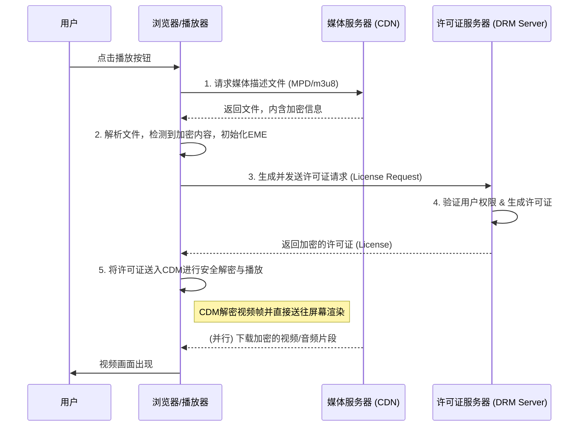

好的，我们已经为DRM的宏伟蓝图描绘了坚实的地基，理解了其从“访问控制”到“使用控制”的深刻转变，以及“内容与许可证分离”的核心思想。现在，是时候从这幅蓝图走向施工现场，亲眼见证这座精密的大厦是如何一砖一瓦地构建起来的。上一章结尾我们留下的问题——播放器、内容服务器和许可证服务器之间到底是如何沟通的？——将在本节得到详尽的解答。

我们将像一位时间旅行者，放慢时间的流速，把用户点击播放按钮后那不到一秒钟内发生的风暴，分解成一幕幕清晰的戏剧。这是一场由三位主角——**你的浏览器（播放器）**、**媒体服务器**和**许可证服务器**——联袂上演的、经过精密编排的数字芭蕾。

***

## 3.2 拆解关键机制：一次完整的DRM播放流程

在我们深入每一个细节之前，让我们先从高空俯瞰整个流程的全貌。这幅流程图将是我们的地图，指引我们穿越接下来复杂的交互细节。



这张图清晰地展示了五大关键步骤。现在，让我们拿起放大镜，逐一审视每一步背后所蕴含的技术、思想与精妙设计。

---

### 步骤一：获取媒体描述文件 (The Blueprint)

**核心动作：播放器从媒体服务器获取MPEG-DASH的MPD或HLS的m3u8文件。**

一切始于一个看似平淡无奇的动作：你打开Netflix，点击了最新一季《王冠》的播放按钮。在幕后，你的浏览器（或App内的播放器）做的第一件事，不是去请求视频本身，而是去请求一个极小的文本文件。这个文件，就是我们所说的**媒体描述文件（Media Presentation Description, MPD）**，或者在苹果生态中，被称为**m3u8播放列表（Playlist）**。

**类比：建筑蓝图与食谱**

把它想象成建筑工地的总工程师拿到的那份**建筑蓝图**，或者一位大厨准备烹饪一道国宴菜肴前得到的**食谱**。

这份蓝图不会给你一块真正的砖头或一根钢筋，但它会告诉你：这栋建筑需要多少砖头、多少钢筋，它们的规格是什么，应该从哪个供应商（服务器地址）那里获取，以及最关键的——某些特定的建材（比如高安全级别的加密视频流）被锁在一个特殊的保险箱里，你需要遵循一套特定的安保协议才能打开它。

同样，这份食谱不会给你一克盐或一滴油，但它会列出所有必需的食材清单，它们的处理方式，以及从哪里采购。更重要的是，它会在某个关键食材旁边标注：“此香料已用密码锁锁住，解锁方法见附录C”。

**技术深潜：`<ContentProtection>` 标签的“警报”**

对于支持DRM的现代流媒体协议（如MPEG-DASH），这份“蓝图”文件（MPD）是一个XML格式的文本文件。其中最关键的部分，就是那个向浏览器发出“警报”的`<ContentProtection>`标签。

让我们来看一个简化的MPD片段实例：

```xml
<MPD xmlns="urn:mpeg:dash:schema:mpd:2011">
    ...
    <Period>
        <AdaptationSet mimeType="video/mp4" codecs="avc1.640028">
            <!-- 关键部分：内容保护描述 -->
            <ContentProtection 
                schemeIdUri="urn:uuid:edef8ba9-79d6-4ace-a3c8-27dcd51d21ed" 
                value="com.widevine.alpha">
                <!-- cenc:pssh 元素包含了初始化解密所需的数据 -->
                <cenc:pssh>AAAA...ZZZZ</cenc:pssh> 
            </ContentProtection>
            
            <Representation id="1" bandwidth="4190000" width="1920" height="1080">
                <BaseURL>video_1080p_encrypted.mp4</BaseURL>
                ...
            </Representation>
            <Representation id="2" bandwidth="2080000" width="1280" height="720">
                <BaseURL>video_720p_encrypted.mp4</BaseURL>
                ...
            </Representation>
        </AdaptationSet>
    </Period>
</MPD>
```

当浏览器解析到这个文件时，它就像阅读食谱的大厨看到了那个“密码锁”标记一样，立刻警觉起来。

-   `schemeIdUri`: 这是一个全球唯一的标识符，它告诉浏览器：“嘿，这里的内容是被某个特定的DRM系统加密的！” 比如，`urn:uuid:edef8ba9-79d6-4ace-a3c8-27dcd51d21ed` 这个看似随机的字符串，是行业内公认的、指向Google Widevine DRM系统的“门牌号”。如果是微软的PlayReady或苹果的FairPlay，这里会是它们各自的UUID。
-   `cenc:pssh (Protection System Specific Header)`: 这个长长的、看起来像乱码的字符串，是DRM系统留下的“公开线索”。它不是密钥本身，而是包含了足够的信息，让播放器知道如何与正确的许可证服务器通信，以及如何构建许可证请求。可以把它理解为那个密码锁上贴着的标签，上面写着：“此锁由‘SafeHouse安保公司’制造，请联系他们的‘全球授权中心’，并报上客户代码 #SH12345 以获取开锁指令。”

至此，第一步完成。播放器尚未下载任何一个视频字节，但它已经通过这份“蓝图”得知了一个至关重要的信息：**接下来的任务，将不是一次普通的下载，而是一次高度安全的解密行动。** 这个认知，将直接触发我们的第二步。

---

### 步骤二：初始化EME (The Universal Translator)

**核心动作：浏览器检测到加密内容，通过Encrypted Media Extensions (EME) API启动解密流程。**

在第一步中，浏览器发现了加密的“警报信号”。现在，它必须启动内部的安全机制来应对。这个机制，就是由万维网联盟（W3C）标准化的**加密媒体扩展（Encrypted Media Extensions, EME）** API。

**背景与叙事：从插件之战到标准化**

要理解EME的革命性，我们必须回到它的“前世”。在HTML5和EME出现之前，浏览器本身并不具备播放加密视频的能力。如果你想在网页上看受保护的内容，就必须安装第三方插件，比如Adobe Flash或Microsoft Silverlight。

这带来了一场混乱的“插件之战”：
-   **问题**：用户体验极差，需要安装、更新、维护各种插件，且插件经常成为安全漏洞的重灾区。开发者也苦不堪言，需要为不同的平台和插件开发多个版本的播放器。浏览器厂商则失去了对核心媒体能力的控制。
-   **解决方案**：W3C推出EME标准，旨在提供一个**统一的、与插件无关的JavaScript API**，让网页开发者可以通过一套标准代码来处理所有主流的DRM系统。
-   **影响**：EME的出现，彻底终结了网页视频播放的插件时代。它让Netflix、YouTube等服务能够无缝地在所有现代浏览器（Chrome, Firefox, Safari, Edge）上提供受DRM保护的高清内容，极大地促进了Web流媒体的繁荣。

**类比：联合国同声传译系统**

EME本身并不负责解密，理解这一点至关重要。它的角色更像是一个**联合国的同声传译系统**，或者一个高级外交场合的**礼宾官**。

想象一个国际会议，台上坐着说英语的美国代表（网页播放器JavaScript代码）、说俄语的俄罗斯代表（Widevine DRM系统）和说中文的中国代表（PlayReady DRM系统）。

-   **没有EME的时代（插件时代）**：美国代表想和俄罗斯代表沟通，必须自带一个专门的英俄翻译（Flash/Widevine插件）。想和中国代表沟通，又得另找一个英中翻译（Silverlight/PlayReady插件）。场面混乱，效率低下。
-   **有EME的时代**：会议厅安装了一套标准的同声传译系统（EME API）。美国代表只需要用标准的会议语言（JavaScript API调用）对着麦克风说：“请帮我向目标代表请求解密密钥。” 这套系统会自动识别出他想沟通的对象是俄罗斯代表，然后将请求无缝地转接给坐在小隔间里的、经过严格安全审查的英俄同声传译员（**内容解密模块 - CDM**）。

EME就是这个标准化的“中间人”，它为上层应用（JavaScript）和底层具体、封闭的DRM实现（CDM）之间架起了一座桥梁。它负责传递消息，但不关心消息的具体内容。

**技术深潜：`requestMediaKeySystemAccess`**

当播放器代码（如 Shaka Player 或 video.js）通过MPD知道需要Widevine DRM时，它会执行类似下面的JavaScript代码：

```javascript
const keySystemConfig = [{
    initDataTypes: ['cenc'],
    audioCapabilities: [{ contentType: 'audio/mp4; codecs="mp4a.40.2"' }],
    videoCapabilities: [{ contentType: 'video/mp4; codecs="avc1.4d401e"' }]
}];

navigator.requestMediaKeySystemAccess('com.widevine.alpha', keySystemConfig)
    .then((keySystemAccess) => {
        // 浏览器确认支持Widevine，并找到了对应的CDM
        // 下一步：创建MediaKeys实例，准备处理许可证
        return keySystemAccess.createMediaKeys();
    })
    .then((mediaKeys) => {
        // MediaKeys实例已创建，可以与CDM交互了
        // ...
    });
```

这行代码 `navigator.requestMediaKeySystemAccess('com.widevine.alpha', ...)` 就像那位美国代表按下了“连接俄罗斯翻译”的按钮。浏览器会去检查：“我的系统里有没有一个叫‘com.widevine.alpha’的、经过认证的翻译员（CDM）？他能处理我需要的音视频格式吗？” 如果答案是肯定的，EME流程就成功初始化了。浏览器已经找到了那个能执行解密任务的“安全黑盒”，并为它做好了接收任务的准备。

---

### 步骤三：请求许可证 (The Formal Request)

**核心动作：播放器向许可证服务器发起许可证请求，请求中包含内容ID和设备的认证信息。**

现在，舞台已经搭好，演员各就各位。播放器通过EME找到了正确的CDM，接下来就需要代表用户，向远方的许可证服务器发起一次正式的、高度安全的请求，以获取那把解密的“金钥匙”。

这个请求不是一个简单的URL GET，而是一个精心构造的、被称为**“挑战（Challenge）”**的二进制数据包。

**类比：申请进入绝密档案室**

想象一下，你是一位特工，需要进入CIA总部的绝密档案室查阅一份文件。你不能直接走进去说：“嗨，把‘X计划’的文件给我。” 你需要遵循一个严格的流程：

1.  你找到档案室门口的安全终端（**CDM**）。
2.  你插入你的特工身份证（**设备唯一标识符**）。
3.  终端机不会直接联网，而是根据你的身份和你请求的文件（**内容ID**），生成一个加密的、一次性的请求包（**许可证请求/Challenge**）。这个包里包含了你的生物特征信息、终端机的序列号以及请求的精确时间，所有信息都用CIA内部的最高加密算法进行了处理。
4.  你拿着这个无法被任何人（包括你自己）篡改和读取的请求包，通过一个安全的通信渠道（**HTTPS**），发送给CIA的授权中心（**许可证服务器**）。

这个由CDM生成的“挑战”，就是我们的许可证请求。它由CDM在底层生成，对JavaScript代码来说是完全不透明的。播放器只负责把它作为一个“黑盒”数据，通过XMLHttpRequest或Fetch API发送出去。

**技术深潜：`createSession` 和 `generateRequest`**

在EME流程中，这一步是这样发生的：

1.  播放器代码创建一个 `MediaKeySession` 对象，这代表了一次解密会话。
2.  然后，播放器调用 `session.generateRequest()` 方法，并将从MPD文件里获得的 `pssh` 数据作为输入。
3.  CDM接收到这个指令和 `pssh` 数据后，会在其安全的“黑盒”内部，生成那个二进制的“挑战”数据。
4.  CDM通过一个 `message` 事件，将这个“挑战”数据返回给JavaScript层。

```javascript
// ...接上一步，已获取mediaKeys对象
const keySession = mediaKeys.createSession();

keySession.addEventListener('message', (event) => {
    // CDM 生成了许可证请求 (event.message)
    const licenseRequest = event.message;

    // 将这个二进制的请求包通过POST发送给许可证服务器
    fetch('https://license.service.com/getlicense', {
        method: 'POST',
        body: licenseRequest
    }).then(response => response.arrayBuffer())
      .then(license => {
          // 步骤五会用到：收到了服务器返回的许可证
          keySession.update(license);
      });
});

// 触发CDM生成请求
// 'initData' 就是从MPD的pssh中提取的数据
keySession.generateRequest('cenc', initData);
```

这一步的核心在于，**请求的发起者是设备上最可信的那个部分（CDM），而不是容易被篡改的网页代码。** 这确保了许可证服务器收到的请求是真实、合法且来自一个可信环境的。

---

### 步骤四：颁发许可证 (The Verdict and The Key)

**核心动作：许可证服务器验证用户权限，然后颁发一个包含解密密钥的许可证。**

许可证服务器收到了这份来自远方CDM的、加密的“挑战”。现在，轮到它执行DRM体系中至关重要的商业逻辑和加密操作了。

**类比：授权中心的严格审查**

回到我们特工的类比。CIA授权中心（**许可证服务器**）收到了你递交的那个加密请求包。它会执行两项核心任务：

**任务A：审查你的身份和权限（Authentication & Authorization）**

-   授权中心首先会验证请求包的完整性和来源的真实性。它不会用自己的私钥去“解密”这个请求，而是会校验其中包含的、由CDM在安全环境中生成的数字签名或设备凭证，以此来确认请求确实来自一个可信的设备，并且内容未被篡改。
-   然后，它会查询内部数据库：这位特工是谁？他的任务授权是否有效？他请求的“X计划”是否在他被允许访问的密级之内？他是否有过违规记录？他是否在授权的地点和设备上发起的请求？

在流媒体世界里，这就是许可证服务器检查的：
-   **用户身份**：通过Cookie、Token等方式，确认这是不是一个合法的付费用户。
-   **订阅状态**：用户的订阅是否在有效期内？是高级会员还是普通会员？
-   **商业规则**：用户请求的是一部租赁的电影，是否在48小时的观看期内？用户是否已经达到了5台设备的播放上限？用户所在的地理位置是否被允许观看此内容？

如果任何一个环节审查失败，服务器会直接拒绝请求，返回一个错误。你的播放器就会显示“播放授权失败”之类的提示。

**任务B：签发带有规则的钥匙（License Generation）**

-   如果审查通过，授权中心不会直接给你一把万能钥匙。它会找到“X计划”档案柜的专用钥匙（**内容密钥 - Content Key**）。
-   然后，它会制作一个全新的、一次性的“智能钥匙卡”（**许可证**）。这张卡里不仅包含了那把钥匙，还写入了明确的规则，比如：“此卡只能在XYZ号档案室的读卡器上使用（**设备绑定**），有效时间仅为今天下午2点到4点（**时间限制**），并且只能打开‘X计划’的A-C卷，不能打开D-F卷（**内容权限**）。”
-   最后，这张“智能钥匙卡”本身会被再次加密，加密方式是只有你最初使用的那个安全终端（**CDM**）才能解开的。

这个加密后的、捆绑了密钥和规则的“智能钥匙卡”，就是服务器返回给浏览器的许可证。

---

### 步骤五：安全解密与播放 (The Magic in the Black Box)

**核心动作：许可证被安全地传递给内容解密模块 (CDM)，CDM在受保护的环境中解密媒体数据并送往播放器渲染。**

浏览器通过上一步的`fetch`调用，拿到了这个从许可证服务器返回的、加密的许可证。对于JavaScript代码来说，这依然是一团无法理解的二进制数据。它的唯一使命，就是将这个“包裹”原封不动地递交给等待已久的CDM。

**类-比：在绝密档案室里阅读**

你拿着授权中心发回的加密“智能钥匙卡”，回到了档案室门口的安全终端（**CDM**）。

-   你将卡片插入终端。终端内部的安全芯片（**硬件级DRM**）验证并解密了这张卡。
-   它提取出了那把真正的钥匙和附带的规则。
-   现在，你被允许进入档案室。但这个档案室非常特殊：它是一个完全封闭的、没有窗户的房间。你不能带纸、笔、相机进去。
-   档案柜（**加密的视频流**）在你面前打开，你只能**一页一页地阅读**。你每读完一页，那一页就会自动销毁（**即时解密**）。你看到的内容会通过一个特殊的、无法被外界监听的内部通道，直接投射到你大脑的视网膜上（**直接渲染到屏幕**），而不会在任何中间环节留下可被复制的文本。

这就是CDM工作的精髓。

**技术深潜：`session.update()` 和可信执行环境**

JavaScript代码通过调用 `keySession.update(license)`，将许可证“喂”给CDM。

```javascript
// ...接步骤三的回调
.then(license => {
    // license 是从服务器获取的加密许可证
    // 将它交给CDM进行处理
    return keySession.update(license);
})
.then(() => {
    console.log('密钥已成功加载，准备播放！');
    // 将HTML <video> 元素与这个解密会话关联
    videoElement.setMediaKeys(mediaKeys);
});
```

一旦CDM成功处理了许可证，它就进入了“待命”状态。此时，播放器开始从媒体服务器（CDN）下载加密过的视频和音频片段。每下载一个片段，就将其送入浏览器底层的媒体管道。媒体管道检测到这些是加密数据，便会将它们转发给已经“上膛”的CDM。

CDM在**受保护的环境（Trusted Execution Environment, TEE）**中进行解密。这是一个与主操作系统隔离的安全区域，类似ARM处理器的TrustZone或Intel的SGX。在这里：

1.  CDM使用从许可证中获得的密钥解密视频帧。
2.  解密后的视频帧**永远不会**返回到主内存或JavaScript环境中。
3.  它们通过一条受硬件保护的路径（**Secure Media Path**），直接被发送给显卡进行解码和渲染。

这就是DRM体系的“最后一公里”，也是它实现“使用控制”的核心所在。用户看到了画面，听到了声音，但他们从未在任何可访问的层面上，接触到未加密的原始数据。那场数字芭蕾至此完美落幕，掌声响起，视频流畅地播放出来。

---

### 要点回顾与核对清单

为了巩固理解，我们可以将这整个复杂的流程，总结为一个“成功播放的核对清单”：

-   [x] **获取蓝图**：播放器是否成功下载并解析了MPD/m3u8文件？
-   [x] **识别警报**：播放器是否在文件中找到了`<ContentProtection>`标签，并识别出正确的DRM系统？
-   [x] **唤醒翻译官**：浏览器是否通过EME API成功初始化了对应的CDM？
-   [x] **生成安全请求**：CDM是否根据`pssh`数据成功生成了许可证“挑战”？
-   [x] **发送请求**：播放器是否已将“挑战”通过HTTPS POST请求发送给许可证服务器？
-   [x] **服务器审查**：许可证服务器是否成功验证了用户的身份、设备和商业规则？
-   [x] **签发许可证**：服务器是否生成了包含密钥和规则的加密许可证并返回给浏览器？
-   [x] **加载密钥**：浏览器是否将许可证成功传递给CDM进行处理？
-   [x] **安全播放**：CDM是否在可信环境中，使用密钥解密媒体流，并将其安全地渲染到屏幕上？

---

### 总结与前瞻：信任的边界

在本节中，我们以近乎显微镜般的精度，完整地拆解了一次DRM播放的全过程。我们看到了一个由标准（EME）、协议（DASH/HLS）和安全模块（CDM）共同协作的、高度自动化的精密系统。从请求一份“蓝图”开始，到在“黑盒”中完成最后一帧画面的解密，每一步都环环相扣，旨在确保内容在分发和播放的整个生命周期中，其使用权都牢牢地掌握在内容提供方手中。

我们反复强调CDM是一个“安全黑盒”或“可信环境”。这个概念是我们理解DRM安全性的基石。然而，这个“黑盒”究竟有多黑？它的“可信”由谁来定义，又由谁来保证？

这引出了我们下一个，也是更深层次的探问：

1.  所有的CDM都是一样安全的吗？所谓的“软件级DRM”和“硬件级DRM”之间，存在着怎样无法逾越的鸿沟？这又如何直接决定了你能在Netflix上看到720p还是4K HDR画质？
2.  既然DRM的执行最终依赖于客户端设备上的一个模块，那么在这个理论上用户拥有最高控制权的“客场”作战，DRM系统如何抵御来自黑客的恶意攻击、逆向工程和破解？这场永无休止的“猫鼠游戏”是如何进行的？

我们刚刚见证了DRM体系完美运作时的优雅舞姿。在下一节，我们将深入战壕，去探寻这套体系在现实世界中面临的挑战、脆弱性以及为应对这些挑战而演化出的不同安全等级。我们将真正地去敲开那个“黑盒”，看看里面到底是什么。