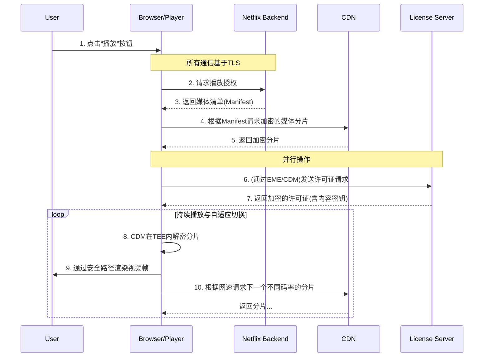

好的，我们现在正式开启第四章的旅程。在前三章中，我们已经分别打下了坚固的地基（理解媒体加密的必要性）、建造了安全的运输通道（TLS协议），并设计了坚不可摧的保险箱（DRM体系）。现在，是时候将这些独立的部件组装起来，看一看这座宏伟的“安全媒体分发大厦”是如何在真实世界中运转的。

---

### 第四章：系统整合与实践 · 构建端到端的安全媒体分发系统

#### **4.1 案例研究：当你在Netflix上点击“播放”时，究竟发生了什么？**

我们生活在一个即时满足的时代。在Netflix、Disney+或任何主流流媒体平台上，从你慵懒地窝在沙发里，指尖轻触“播放”按钮，到高清、流畅的影像和声音充满你的感官，整个过程似乎只是一瞬间的魔法。这“魔法”的背后，是一场精心编排、秒级响应、涉及全球网络和尖端密码学的复杂芭蕾，旨在解决一系列相互冲突的根本性挑战：

*   **如何将一个动辄几十GB的4K电影，在不稳定的互联网上，平滑地传送给数亿用户？**
*   **如何确保这个昂贵的数字资产在传输途中不被窃取或篡改？**
*   **最关键的是，如何在用户的设备上解密并播放它，同时又防止用户（或其设备上的恶意软件）将解密后的内容复制出来？**

我们在前几章中探讨的TLS和DRM，正是解答这些问题的核心技术。现在，让我们以Netflix为例，拉开帷幕，一步步剖析这场数字芭蕾的每一个优雅而精确的动作。这个过程可以被看作一部五幕剧，每一幕都建立在前一幕的基础之上，共同构成了我们所熟悉的无缝体验。

---

### **第一幕：序曲 - 建立一个可信的舞台 (The Startup Phase)**

在你看到任何影片推荐，甚至在搜索框里输入你心仪的剧集名称之前，第一层、也是最基础的安全协议已经悄然启动。

**核心动作：** 用户认证与页面加载（全程HTTPS/TLS保护）。

当你打开 `netflix.com` 或其应用程序时，你的浏览器（或App）与Netflix服务器之间的第一次“握手”，就是通过我们在第二章详细讨论过的TLS协议来完成的。地址栏那把小小的锁标志，远不止是一个装饰。它是一个郑重的承诺：从此刻起，你与Netflix之间的所有通信，都将被封装在一个私密的、无法被窃听和篡改的加密隧道中。

**类比：进入一座高度戒备的大使馆**

想象一下，你要去大使馆领取一份机密文件（电影）。你不能直接闯进去。

1.  **身份验证（登录）：** 你首先要在门口出示你的护照和签证（输入用户名和密码）。门口的警卫（Netflix的认证服务器）会验证你的身份。
2.  **建立安全通信（TLS）：** 一旦身份确认，你并不会在大厅里公开讨论你要取什么文件。警卫会把你带到一个隔音的、安全的会客室（TLS会话）。在这个房间里，你说的每一句话，递交的每一份文件，都会被严格保密，外界无法知晓。

**问题-解决方案-影响链条：**

*   **问题：** 如果没有这层保护，会发生什么？一个在你家路由器、咖啡馆Wi-Fi或任何网络节点上的“中间人”，可以轻易地窃取你的登录凭证、窥探你的观看历史，甚至在你加载页面时，向其中注入恶意广告或脚本。这被称为“会话劫持”或“中间人攻击”。
*   **解决方案：** 强制全站使用HTTPS（即HTTP over TLS）。通过TLS的证书验证、密钥交换和对称加密机制，确保了通信的**机密性**（内容被加密）、**完整性**（内容未被篡改）和**认证性**（你确实在和真正的Netflix服务器对话）。
*   **影响：** 这为后续所有敏感操作（播放请求、许可证获取等）构建了一个绝对可信的基础。没有这个安全舞台，后续的一切保护都将是建立在流沙之上。Netflix不仅保护了你的账户安全，也保护了它自身服务的完整性。

所以，当你看到熟悉的红色“N”字Logo加载出来时，你已经身处一个由TLS精心构建的、坚固的数字堡垒之中了。

### **第二幕：指令下达 - “我想要看这部电影” (The Play Request)**

现在，你已经在这个安全的“大使馆”里了。你浏览片库，最终选定了目标——比如，最新的科幻大片。你点击了播放按钮。

**核心动作：** 浏览器向Netflix后端请求播放授权，后端返回媒体的DASH/HLS清单（Manifest）地址。

你的点击行为，在浏览器中被翻译成一个API请求，通过已建立的TLS隧道发送给Netflix的应用服务器。这个请求大致会包含：“用户A（已认证）想要播放影片B（ID为xxxxx）”。

服务器收到请求后，会进行一系列快速的内部检查：

*   这个用户账户是否有效？
*   他的订阅套餐是否包含这部影片的观看权（例如，是否为4K套餐）？
*   他所在的地理位置是否拥有该影片的播放版权？

如果一切顺利，Netflix服务器并不会直接把一个巨大的 `movie.mp4` 文件扔给你。这种方式效率低下且毫无灵活性。相反，它会返回一个看似不起眼的小文本文件，但这个文件却是整个播放流程的“总剧本”或“藏宝图”。这个文件就是**媒体清单（Manifest）**，通常采用MPEG-DASH或Apple HLS格式。

**类比：获得一份加密的施工蓝图**

你并没有直接得到那份机密文件。相反，大使馆官员给了你一份高度复杂的蓝图（Manifest）。这份蓝图本身并不包含任何实际的建筑材料（视频内容），但它详细说明了：

*   这座“建筑”（电影）被分成了多少个独立的“预制构件”（媒体分片/Chunks）。
*   每个构件都有多种规格（不同的分辨率和码率，如480p, 720p, 1080p, 4K）。
*   在哪里可以找到这些构件的供应商（指向CDN服务器的URL）。
*   最重要的是，蓝图上标注了：**所有构件都被锁在特殊的箱子里（内容是加密的），你需要一种特定的钥匙才能打开。**

**问题-解决方案-影响链条：**

*   **问题：** 互联网连接是动态变化的。如果直接传输一个大文件，任何网络抖动都可能导致播放中断，且无法根据网速调整画质。用户只能在“卡顿”和“等待缓冲”中痛苦挣扎。
*   **解决方案：** **自适应比特率流媒体（Adaptive Bitrate Streaming, ABR）**。将视频预先切分成几秒钟一个的短小分片，并为每个分片制作多种不同质量（比特率）的版本。清单文件（Manifest）就是这些分片的索引。播放器可以根据当前网速，智能地选择下载最合适版本的分片，实现无缝切换。
*   **影响：** 带来了革命性的用户体验。无论你是在高铁上用5G，还是在家用光纤，视频都能尽可能地保持流畅播放。网速好时自动切换到高清，网速差时则平滑地降级以避免缓冲。这种体验的背后，正是由DASH/HLS清单驱动的ABR技术。

至此，你的播放器已经拿到了“剧本”，知道了该去哪里拿“道具”（加密的视频分片），也知道了这些“道具”是上了锁的。接下来，好戏才真正开始。

### **第三幕：兵分两路 - 获取内容与获取钥匙 (The Media & License Acquisition)**

这是整个流程中最核心、最能体现现代媒体安全体系设计精髓的部分。播放器现在需要同时执行两个关键任务，它们并行发生，缺一不可。

**核心动作：**
1.  播放器解析清单，通过CDN下载**加密的**媒体分片（TLS保护）。
2.  同时，通过EME/CDM向许可证服务器请求**内容密钥**（TLS保护）。

#### **任务一：从全球仓库调取“上锁的货箱” (Fetching Encrypted Media)**

播放器根据Manifest文件中的地址，开始向**内容分发网络（CDN）**的服务器请求第一个视频分片。CDN是遍布全球的缓存服务器，它会将热门内容存储在离用户最近的地方，以实现最低延迟和最快速度的交付。

重要的是，这次下载依然在TLS的保护之下。这意味着，即使有人劫持了你和CDN服务器之间的流量，他也只能得到一堆加密的、毫无意义的数据。更重要的是，他得到的分片本身，内容也是被加密的！这是一种双重保险。

#### **任务二：向安全总部申请“万能钥匙” (Acquiring the Decryption Key)**

在请求视频分片的同时，播放器在Manifest中读到了DRM的特定信息（例如，Widevine DRM的`PSSH` box，它包含了内容加密和DRM系统所需的重要初始化数据）。这就像看到了箱子上的锁的型号。这个信息会触发浏览器的一套标准API——**加密媒体扩展（Encrypted Media Extensions, EME）**。

EME是W3C制定的一个Web标准，它充当了网页（JavaScript）与浏览器内置的DRM客户端之间的“翻译官”或“传话筒”。它允许网页发起一个许可证请求，但又不让网页直接接触到任何敏感的密钥信息。

流程如下：
1.  **播放器 (JavaScript)** 通过EME API说：“嘿，我需要一个许可证来播放这个受保护的内容。”
2.  **EME** 将这个请求传递给所谓的**内容解密模块（Content Decryption Module, CDM）**。CDM是浏览器的“黑匣子”，由DRM提供商（如Google Widevine, Microsoft PlayReady）开发和签名，是真正执行密码学操作的可信模块。
3.  **CDM** 根据从Manifest中获取的DRM信息，生成一个加密的“许可证请求（License Request）”。这个请求包含了播放会话的唯一ID，以及CDM自身的一些认证信息，但并不包含任何可以被利用的秘密。
4.  这个许可证请求被交还给播放器的JavaScript，然后由它通过一个独立的、受TLS保护的连接，发送给Netflix的**许可证服务器**。
5.  许可证服务器接收到请求，验证其有效性（例如，与后台的用户播放授权信息进行比对），然后生成一个**许可证（License）**。这个许可证中，包含了用于解密该视频内容所需的一个或多个**内容密钥（Content Keys）**。这些密钥本身又被另一层密钥加密，只有发出请求的那个CDM才能解开。
6.  许可证服务器将这个加密的许可证发回给浏览器。

**类比：双线操作的特工**

想象你的播放器是一位特工。他接到了一个任务（播放电影）。

*   **路线一（获取内容）：** 他派遣一支运输队（HTTP请求），通过安全的路线（TLS），去全球各地的秘密仓库（CDN）提取一个个上锁的保险箱（加密的视频分片）。
*   **路线二（获取钥匙）：** 与此同时，他本人（EME/CDM）使用一个特殊的、无法被窃听的卫星电话（向许可证服务器的TLS连接），向最高指挥部（许可证服务器）发送了一段暗语（许可证请求）。指挥部验证了他的身份和任务代码后，通过这个安全信道，将一把同样被锁在密码盒里（加密的许可证）的钥匙传送给了他。只有他，也只有他，能打开这个密码盒，拿到里面的钥匙。

**问题-解决方案-影响链条：**

*   **问题：** 这正是第三章DRM试图解决的核心矛盾——如何在用户的设备上解密内容，却不把解密密钥的控制权交给用户？如果密钥暴露在JavaScript中，任何稍有技术的用户都可以轻易获取它，从而永久解密视频。
*   **解决方案：** **EME/CDM 架构**。EME提供了一个标准化的“信箱”，而CDM则是那个唯一能打开信件并理解内容的“收信人”。密钥从生成、传输到使用的整个生命周期，都被严格限制在CDM这个可信的“黑匣子”内部，对外界的JavaScript代码完全透明。
*   **影响：** 实现了内容分发（CDN）和安全授权（许可证服务器）的完美解耦。Netflix可以利用全球最高效的CDN来分发加密内容，而将最核心、最敏感的密钥管理牢牢掌握在自己的许可证服务器中。这种架构既保证了安全性，又具备了极高的可扩展性。

### **第四幕：神圣领域 - 在“安全屋”内解密 (The Secure Playback)**

特工现在同时拥有了上锁的保险箱（加密分片）和能打开它的钥匙（许可证中的内容密钥）。但最危险的一步来了：开箱。如果在公共场合开箱，里面的宝物（解密后的视频帧）可能会被瞬间围观、拍照、复制。

**核心动作：** CDM在硬件安全区（如TEE）内使用内容密钥解密分片，并将解密后的视频帧直接送往显卡渲染，防止在内存中被截取。

现代DRM方案的最高安全级别（L1）依赖于硬件级的保护。当CDM拿到许可证并从中解出内容密钥后，它不会在操作系统的主内存（RAM）中进行解密操作。因为主内存是相对开放的，高权限的恶意软件（如屏幕录制工具、调试器）理论上可以读取其中的数据。

取而代之的是：

1.  **可信执行环境（Trusted Execution Environment, TEE）：** CDM会将加密的视频分片和内容密钥，一同送入一个与主操作系统隔离的、基于硬件的“安全世界”（如ARM TrustZone）。CPU会切换到一个特殊模式，在这个模式下执行的代码和处理的数据，连操作系统本身都无法访问。
2.  **安全媒体路径（Secure Media Path）：** 在TEE中解密完成后，生成的未压缩视频帧，并不会返回到主内存。而是通过一条受硬件保护的专用路径，直接传输给图形处理单元（GPU）进行渲染和显示。

**类比：终极保险库与直达通道**

这位特工不会在酒店大堂打开保险箱。他会进入一个只有他能进入的、墙壁由超合金打造、没有窗户、没有网络连接的地下保险库（TEE）。

*   **在保险库内操作：** 他在里面打开保险箱（解密视频）。
*   **专用展示通道：** 宝物（视频帧）被取出后，不会再经过外面的任何走廊，而是通过一条直达展厅防弹玻璃柜（显示器）的、全封闭的传送带（安全媒体路径）送出。

外面的人（包括操作系统和其他程序）只能看到最终在玻璃柜里展示的结果，但永远无法在中途触碰到宝物本身。

**问题-解决方案-影响链条：**

*   **问题：** 软件层面的保护总有被攻破的可能。如何从根本上杜绝在内容播放的最后一刻被窃取（例如，通过内存抓取或软件录屏）？
*   **解决方案：** 利用现代芯片提供的硬件级安全功能（TEE），构建一个从解密到显示的端到端“安全媒体路径”。
*   **影响：** 这是内容保护的最后一道，也是最坚固的一道防线。它使得高质量内容（4K, HDR）的分发成为可能。这也是为什么在某些设备或浏览器上，你无法观看最高画质的Netflix——因为它们不具备L1级别的硬件DRM支持。内容所有者（电影制片厂）只有在确信内容能被如此强有力地保护时，才愿意授权流媒体平台播放其顶级资产。

### **第五幕：无形的指挥家 - 动态调整与循环 (The Adaptive Loop)**

这部“芭蕾”并非只表演一次。从你点击播放到影片结束，第三幕和第四幕的循环正在以每秒数次的频率高速、静默地进行着。

**核心动作：** 播放器持续监控网络状况，动态请求不同码率的加密分片，整个过程无缝进行。

播放器内部有一个“指挥家”，它时刻关注着一个关键指标：**缓冲区（Buffer）**的健康状况。缓冲区就像是即将上场的演员的等候区。播放器总是试图让这个等候区里有足够多的“演员”（未来的视频分片），以应对突发的网络延迟。

*   如果“指挥家”发现网络很快，等候区人满为患（缓冲区很满），它就会在下一次请求时，从Manifest中选择更高质量（比如4K）的分片URL。
*   如果网络突然变差，等候区的人快要走光了（缓冲区即将耗尽），它会立刻做出决断，请求一个体积更小、更容易传输的低质量（比如720p）分片，以确保演出不会中断。

这个决策循环贯穿始终。而每一次请求的新分片，无论质量高低，都同样是加密的，都需要在CDM的安全环境中走一遍解密流程。DRM的保护与ABR的灵活性在这里完美融合。

---

### **总结与展望**

当你点击Netflix上的“播放”按钮时，你触发的远非一个简单的下载。你启动了一套精密协作的系统，一场在毫秒之间完成的全球性安全接力：

1.  **TLS** 搭建了一个私密的通信舞台。
2.  **ABR (DASH/HLS)** 提供了灵活、流畅的观看体验蓝图。
3.  **CDN** 将加密的内容高效地从全球各地运送到你面前。
4.  **DRM (EME/CDM)** 则扮演了最关键的角色：作为钥匙的唯一掌管者，确保内容在被消费的同时，其所有权依然受到牢不可破的保护。
5.  **硬件安全（TEE）** 为这场保护行动提供了最终的、物理层面的保障。

这五个环节环环相扣，共同构建了一个既能满足用户对高质量、即时娱乐的需求，又能满足内容创作者对版权保护的核心诉求的复杂平衡。

**图示：Netflix播放流程时序图**

这个案例完美地将我们前面章节的所有理论知识串联成一个生动的实践故事。然而，这个故事也引出了新的问题：

*   **复杂性的代价是什么？** 如此复杂的系统，必然会带来性能开销和潜在的故障点。在实际工程中，如何进行监控、调试和优化？
*   **有没有“万能”的DRM？** 我们看到了Widevine, PlayReady, FairPlay的存在。一个内容提供商如何以最低的成本和复杂性，同时支持所有这些平台？
*   **道高一尺，魔高一丈？** 尽管有如此严密的保护，盗版依然存在。攻击者们试图从哪些我们尚未讨论的薄弱环节入手？

这些问题，将是我们接下来要深入探讨的方向。通过理解Netflix的“魔法”，我们不仅掌握了现有系统的运作原理，也获得了审视其未来演进方向的深刻洞察力。