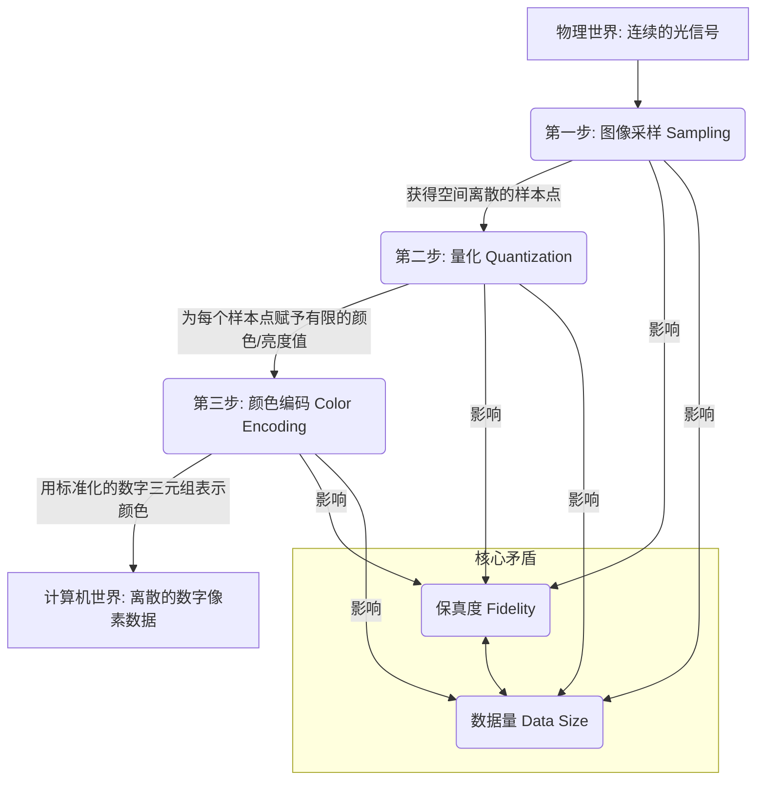

好的，请看这篇为您精心撰写的课程开篇内容。我将以一位教育家与作家的身份，带您深入探索数字视频的基石。

---

# 第一章：数字视频的基石 · 从物理世界到数字表示

## 1.1 根本问题：如何将连续的视觉信息转为离散的数字信号？

欢迎来到 Web 媒体技术的世界。在你开始阅读这行文字的瞬间，你可能刚刚在手机上划过一个短视频，或是在电脑上点开了一部高清电影。这些无处不在的数字视频，以其流畅的画面和绚丽的色彩，构成了我们信息时代的重要组成部分。但你是否曾停下来思考一个看似简单却无比深刻的问题：

**我们眼中那个丰富、细腻、光影流转的真实世界，是如何被“装进”一个由冰冷的 0 和 1 构成的数字文件中的？**

这个问题的答案，不仅是整个数字媒体技术的起点，更是一段跨越物理学、数学和计算机科学的迷人旅程。它关乎一次根本性的“翻译”——将自然的语言（连续的光波）翻译成计算机的语言（离散的比特流）。本章，我们将共同揭开这层神秘的面纱，理解这一翻译过程中的核心挑战、根本矛盾，以及为解决它们而构建的经典框架。

### 核心挑战：世界是连续的，而计算机是离散的

让我们先从一个简单的思想实验开始。想象你正站在山顶，眺望日落。你的眼前是无垠的天空，色彩从地平线的炽热橙红，平滑地、无缝地过渡到头顶的深邃蔚蓝。云层的边缘被金光勾勒，每一缕光线的强度和色彩都在以一种无法分割的、连续的方式变化着。你伸出手，感受到的风速也是连续变化的，时而轻柔，时而急促。

**这个我们赖以生存的物理世界，其本质是“模拟（Analog）”或“连续（Continuous）”的。**

“连续”意味着在任意两个可度量的点之间，永远存在无限多个中间点。天空的蓝色和紫色之间，存在着无限种“蓝紫色”；光线从亮到暗，经历了无限多个亮度层次。这就像一条平滑的斜坡，你可以站在斜坡上的任意一个位置，无论多么微小的移动，你都处于一个新的、独一无二的高度。

现在，让我们把目光转向处理这些信息的工具——计算机。在其最底层，计算机是一个“数字（Digital）”或“离散（Discrete）”的系统。它不理解“无限”或“平滑过渡”。它所能理解和处理的，只有两个明确的状态：0（关）和 1（开）。所有复杂的软件、绚丽的游戏、动人的音乐，最终都被还原为海量的、由 0 和 1 组成的序列。

**计算机的世界就像一段台阶。** 你可以站在第一级台阶，也可以站在第二级台阶，但你无法站在“第一点五级”台阶上。台阶与台阶之间，是无法跨越的鸿沟。

*(图示：左侧为平滑的斜坡，代表连续信号；右侧为阶梯，代表离散信号)*

**因此，我们面临的第一个，也是最根本的挑战，就是一个哲学层面上的对立：如何用有限、离散的台阶，去尽可能精确地描述一个无限、连续的斜坡？**

这个问题，是所有模拟信息数字化（Analog-to-Digital Conversion, ADC）的核心。无论是录制声音、测量温度，还是我们即将深入探讨的——捕捉影像，都必须首先跨越这道鸿沟。

### 核心矛盾：保真度 (Fidelity) vs. 数据量 (Data Size) 的根本权衡

在尝试用台阶模拟斜坡时，你很快会发现一个问题。如果你的台阶很高、很宽，那么你构建出的阶梯将非常粗糙，与原始的平滑斜坡相去甚远。为了更精确地模拟斜坡，一个直观的解决方案是：**让台阶变得更多、更密集。**

-   **让台阶在水平方向上更窄**：这意味着我们更频繁地进行测量，捕捉斜坡在水平位置上的变化。
-   **让台阶在垂直方向上更矮**：这意味着我们用更精细的刻度来描述斜坡在每个测量点的高度。

这个方案无疑是有效的。当台阶变得无限窄、无限矮时，它在理论上就无限接近于那条完美的斜坡。但“无限”这个词，在计算机科学中通常意味着灾难。因为每增加一个台阶，都意味着需要更多的材料去建造它——在数字世界里，这些“材料”就是存储空间和计算资源。

**这便引出了数字视频乃至整个数字媒体领域永恒的核心矛盾：保真度（Fidelity）与数据量（Data Size）之间的权衡。**

-   **保真度 (Fidelity)**：指数字信号在多大程度上忠实地再现了原始的模拟信号。更高的保真度意味着画面更清晰、色彩更丰富、更接近真实世界。
-   **数据量 (Data Size)**：指存储和传输这些数字信号所需要的比特数量。

让我们用一个更贴切的类比来理解这个权衡：**绘制一幅超高精度的世界地图**。

1.  **高保真度版本**：你决定要绘制一幅1:1比例的、能看清地球上每一粒沙子的地图。这幅地图的保真度将是完美的，它就是地球本身。但它的“数据量”也是无穷大的——你需要一个和地球一样大的存储空间来存放它，传输它更是天方夜谭。

2.  **低保真度版本**：你绘制了一幅儿童简笔画式的世界地图，用几个简单的色块代表大陆和海洋。这幅地图的数据量极小，一张纸就能装下。但它的保真度极低，丢失了几乎所有的细节。

3.  **现实中的权衡**：我们实际使用的地图，如谷歌地图，就是这种权衡的产物。它通过一系列巧妙的技术，在可接受的数据量下，提供了极高的保真度。但即便如此，你放大到极限，依然会看到像素化的图像，而不是真实的沙粒。它依然是用“台阶”在模拟“斜坡”。

在数字视频领域，这种权衡无处不在。电影制片厂可能使用数TB（Terabyte）的原始素材来追求极致的保真度。而当我们通过流媒体观看时，视频平台会通过压缩算法，在保证可接受观看体验的前提下，将数据量减少数百倍，以便在有限的带宽下流畅播放。

理解了这个核心矛盾，你就掌握了解读所有媒体技术的关键视角。从视频编码（如H.264, HEVC）到图像格式（如JPEG, PNG），它们所有的复杂算法，本质上都是在“保真度 vs. 数据量”这条钢丝上，寻找不同场景下的最佳平衡点。

### 基本框架：从光信号到数字像素的“翻译”流水线

现在，我们已经明确了目标（用离散描述连续）和约束（在保真度和数据量之间权衡），是时候构建一套切实可行的“翻译”流程了。这个将连续光信号转换为离散数字像素的过程，可以被抽象为一个经典的三步流水线（Pipeline）。

让我们用一个 Mermaid 流程图来清晰地展示这个过程：

下面，我们将深入剖析流水线中的每一步，理解它们分别解决了什么问题，以及它们是如何体现“保真度 vs. 数据量”这一核心矛盾的。

#### 第一步：图像采样 (Sampling) - 空间离散化

-   **问题**：一幅画面，例如你眼前的这片屏幕，在空间上是连续的。光线充满了整个视野，我们如何开始测量？我们不可能测量每一个无穷小的点。
-   **解决方案**：我们不能测量所有点，但我们可以测量“足够多”的点。**采样**就是在连续的空间上，周期性地提取样本值的过程。对于图像而言，这具体表现为**在画面上铺设一张虚拟的、看不见的网格，然后只测量每个网格交叉点的光线信息。**
-   **类比：十字绣**
    想象一下，你想把一幅梵高的《星空》复制成一幅十字绣作品。原作的笔触和色彩是连续流动的，但你的十字绣画布是由一个个正方形的小格子组成的。你所能做的，就是观察画布上每个格子对应的原作区域，然后选择一种最能代表该区域平均色彩的绣线，在这个格子里绣一个“X”。

    

    *(图示：左侧为连续的绘画，右侧为由离散格子组成的十字绣)*

    在这个类比中：
    -   **原作《星空》** 就是连续的物理世界光信号。
    -   **十字绣的网格** 就是我们的采样网格。
    -   **每一个绣好的格子** 就是一个 **像素 (Pixel, Picture Element)**，它是数字图像的最小单位。
    -   **网格的密度** (每英寸多少个格子) 就对应着图像的 **分辨率 (Resolution)**。

-   **影响与权衡**：
    -   **保真度**：采样网格越密集（分辨率越高），我们提取的样本点就越多，十字绣的格子就越小，最终的图像就越细腻，越接近原作。720p (1280x720) 的视频看起来有颗粒感，而 4K (3840x2160) 的视频则清晰锐利，根本原因就在于后者的采样网格密度远高于前者。
    -   **数据量**：网格密度翻倍，像素点的总数会成平方级增长。一个 4K 图像的像素数量是一个 1080p (1920x1080) 图像的四倍。这意味着，仅仅是提高空间采样的精度，就会导致数据量的急剧膨胀。

    通过采样，我们成功地将空间上连续的图像，转换为了一个由有限数量的、离散的像素点组成的矩阵。我们完成了“斜坡”到“台阶”在**水平方向**上的离散化。

#### 第二步：量化 (Quantization) - 幅度离散化

-   **问题**：好了，我们现在有了一个像素矩阵。但是，在每个像素点上，我们从真实世界测量到的光线，其色彩和亮度依然是连续的。正如我们之前所说，深红和“稍微不那么深”的红之间，存在无限多种红色。我们无法用有限的数字来表示这无限的色彩。
-   **解决方案**：我们必须创建一个有限的、可供选择的“调色板”。**量化**就是将一个连续的取值范围，映射到多个离散的、预设的级别（Quantization Levels）之一的过程。
-   **类比：儿童绘画的“数字油画”套装**
    你买了一套“数字油画”套装，画布上印有带编号的区域，同时附赠了24个带编号的颜料罐。原作可能拥有成千上万种微妙的色彩变化，但这套工具强迫你做出选择：对于画布上编号为“7”的区域，你只能使用“7号”颜料罐里的颜色，即使你觉得原作的颜色介于“7号”和“8号”之间。你必须选择一个最接近的。

    

    *(图示：左侧为色彩丰富的照片，右侧为经过量化、色彩数量减少的“色块化”图像)*

    在这个类比中：
    -   **原作的无限色彩** 就是每个采样点上连续的亮度/色彩值。
    -   **24个颜料罐** 就是我们预设的量化级别。
    -   **将画布区域指定给特定颜料编号的过程** 就是量化。

-   **影响与权衡**：
    -   **保真度**：颜料罐的数量越多（量化级别越多），你能表达的色彩就越细腻，最终的画作就越逼真。在数字视频中，这通常由 **位深度 (Bit Depth)** 来描述。一个 8-bit 的图像，意味着每个颜色通道（红、绿、蓝）有 2^8 = 256 个级别。这就是我们常说的 1670 万色（256 x 256 x 256）。而专业的 10-bit 图像，每个通道有 2^10 = 1024 个级别，能表现超过 10 亿种颜色，色彩过渡会平滑得多，不易出现色彩断层（Banding）。
    -   **数据量**：描述 256 个级别，只需要 8 个比特；而描述 1024 个级别，则需要 10 个比特。位深度的增加，直接导致了存储每个像素所需的数据量的增加。从 8-bit 增加到 10-bit，每个像素的数据量就增加了 25%。

    通过量化，我们成功地将每个像素上连续的色彩/亮度值，转换为了一个从有限“调色板”中选出的、离散的整数值。我们完成了“斜坡”到“台阶”在**垂直方向**上的离散化。

#### 第三步：颜色编码 (Color Encoding) - 标准化表示

-   **问题**：经过采样和量化，我们已经得到一个数字矩阵。矩阵中的每个元素都是一个或多个整数，代表了一个像素的颜色。但这个数字本身并没有意义。计算机如何知道数字“255”代表“纯红色”？我们需要一套共同的语言或规则来解释这些数字。
-   **解决方案**：建立一个 **色彩空间 (Color Space)** 和 **色彩模型 (Color Model)**。这套系统定义了如何用一组数值来表示颜色。最常见的就是 **RGB 色彩模型**。
-   **类比：鸡尾酒配方**
    你不能只告诉酒保“给我一杯红色的鸡尾酒”。“红色”太模糊了。你需要一个精确的配方，比如：“30毫升伏特加，90毫升蔓越莓汁，15毫升青柠汁”。这个配方是精确的、可复现的。任何人按照这个配方，都能调出基本相同的鸡尾酒。

    在这个类比中：
    -   **最终的鸡尾酒颜色** 就是我们想表示的颜色。
    -   **“伏特加、蔓越莓汁、青柠汁”** 就是构成颜色的基本“原色”，在 RGB 模型里就是 **红 (Red)、绿 (Green)、蓝 (Blue)**。
    -   **“30毫升、90毫升、15毫升”** 就是量化后的数值，代表每种原色的强度。

    **RGB 颜色编码** 就是告诉计算机，每个像素的颜色都由这三种基本光源（红、绿、蓝）混合而成。一个像素的颜色，不再是单一的数字，而是一个包含三个数值的元组（Tuple），例如 `(R, G, B)`。对于一个 8-bit 的系统，每个值的范围是 0 到 255。
    -   `(255, 0, 0)` 代表纯红色。
    -   `(0, 255, 0)` 代表纯绿色。
    -   `(0, 0, 0)` 代表黑色（没有光）。
    -   `(255, 255, 255)` 代表白色（所有光开到最亮）。
    -   `(212, 175, 55)` 代表一种金色。

-   **影响**：
    颜色编码为数字化的颜色信息提供了**结构和标准**。它确保了在支持相同色彩空间的不同设备上（例如你的显示器和我的手机），`(255, 0, 0)` 都能被正确地解释和显示为红色。这为后续的图像处理、压缩和显示奠定了坚实的基础。虽然我们这里主要讨论 RGB，但在后续章节你会了解到，为了更高效地进行视频压缩，业界更广泛地使用 YUV (YCbCr) 等其他色彩模型，其本质同样是为颜色提供一种结构化的数字表示。

### 总结与展望

让我们回到最初的问题：如何将连续的视觉信息转为离散的数字信号？

通过今天的探索，我们描绘出了一条清晰的路径。我们首先直面了物理世界的连续性与计算机世界的离散性这一根本矛盾。接着，我们认识到在弥合这一鸿沟的过程中，必须在**保真度**和**数据量**之间做出永恒的权衡。最后，我们构建了一个三步走的基础框架：

1.  **采样 (Sampling)**：通过铺设网格，将无限的**空间**信息离散化为有限的像素点，其核心参数是**分辨率**。
2.  **量化 (Quantization)**：通过创建有限的调色板，将每个像素上无限的**色彩/亮度**信息离散化为有限的整数值，其核心参数是**位深度**。
3.  **颜色编码 (Color Encoding)**：通过建立如 RGB 这样的标准模型，赋予这些离散的整数值以明确的、可复现的**颜色意义**，形成了**色彩空间**。

这三步，如同一座宏伟建筑的地基，支撑起了整个数字视频世界。它们共同协作，完成了从光到比特的伟大翻译。

**然而，这仅仅是故事的开始。**

我们迄今为止讨论的，仅仅是如何“捕捉”一幅静止的图像。但视频的本质是**运动**。当时间这一新的维度被引入，我们的流水线将面临怎样的新挑战？

-   我们如何对连续的**时间**进行“采样”？这会引出“帧率”的概念。
-   人眼对亮度和色彩变化的感知是否对称？利用这种不对称性，我们是否能在颜色编码环节找到压缩数据量的绝佳机会？（剧透：是的，这就是 YUV 色彩模型的奥秘所在。）
-   面对视频中相邻帧之间大量的冗余信息，我们又该如何运用更高级的手段，在这场“保真度 vs. 数据量”的博弈中，取得更惊人的胜利？

带着这些问题，我们即将在下一节课中，踏入时间的世界，探索数字视频的第二个基石：运动的表示。