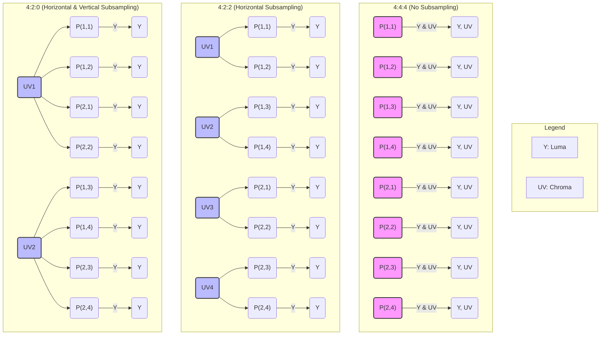

好的，我将以一位教育家与作家的身份，承接上文，为您续写 1.3 小节的内容。我将严格遵循您的要求，确保内容的深度、清晰度与启发性，并自然地融入叙事，带领读者进入色彩压缩的奇妙世界。

---

## 1.3 拆解关键机制(二)：色彩空间与色度子采样

在上一节的末尾，我们站在了由原始视频数据构成的“数据珠穆朗玛峰”脚下。通过简单的计算，我们震惊地发现，即便是短短一分钟、规格平平的未压缩视频，其数据量也足以轻易塞满一部手机的存储空间。这个数字不仅揭示了挑战的艰巨，更将我们引向了一个激动人心的方向：我们必须开始“压缩”。

但这并非一次野蛮的、不分青红皂白的“数据 demolition”。真正的艺术，在于进行一场**“感知外科手术”**——精准地切除那些对人类视觉系统而言无关紧要、甚至无法察觉的信息，同时小心翼翼地保留构成画面灵魂的所有关键细节。我们的第一个手术目标，就隐藏在每一个像素最核心的属性之中：**色彩**。

这一节，我们将深入探讨视频压缩的第一步，也是最经典的一步“感知欺骗”：为什么视频不直接使用我们熟知的 RGB，而是转向一个名为 YUV (或更准确地说是 YCbCr) 的色彩空间？以及，这个转变如何为一项名为**色度子采样 (Chroma Subsampling)** 的巧妙技术打开大门，让我们能在几乎不牺牲主观画质的前提下，将原始数据量直接“腰斩”。

### 问题的根源：为何 RGB 不适合压缩？

自我们接触计算机图形开始，RGB 模型就如同空气般自然。Red (红), Green (绿), Blue (蓝)——三原色光，通过不同强度的混合，创造出我们屏幕上的万千色彩。这套系统完美地模拟了我们显示器的工作原理：每个像素点就是由这三个微小的发光体组成的。它直观、易于理解，是**为“显示”而生的模型**。

然而，当我们的目标从“显示”转向“存储和传输”时，RGB 模型的内在缺陷便暴露无遗。它的核心问题在于：**亮度和色彩信息被紧密地耦合（Coupled）在一起。**

**类比：一碗成分不明的“果昔”**

想象一下，RGB 就像一碗已经用多种水果打好的果昔。比如，一个特定的橙色像素 `(R:255, G:165, B:0)`，它的“亮度”和“色彩”信息是混合在这三个数值里的。你无法单独拿出一个数值说“这是亮度”，另一个说“这是颜色”。它们共同定义了最终的感官体验。

现在，假设你想对这碗果昔做个小手术：**在不改变其“水果风味”（色彩）的前提下，让它变得“更浓稠”或“更稀薄”（亮度）**。这会非常困难。你增加或减少任何一种水果（R, G, B），不仅会影响浓稠度，也必然会改变整体的风味和颜色。

同理，在 RGB 空间中，一个像素的亮度（Luminance）大致可以理解为 R, G, B 值的一个加权平均值。这意味着，三个分量都对最终的亮度有贡献。这种“你中有我，我中有你”的结构，对于压缩算法来说，简直是一场噩梦。因为我们的“感知外科手术”需要一个清晰的手术台，能够让我们**独立地操作亮度和色彩**。如果二者纠缠不清，我们就无法实施后续的精准切除。

### 解决方案：YUV 的诞生，一次优雅的“解耦”

这个问题的解决方案，堪称工程史上一次将人类生理学特性与数学模型完美结合的典范。它的核心思想极其优雅：**既然 RGB 把亮度和色彩混在一起，那我们就设计一套新的坐标系统，从一开始就将它们彻底分开。** 这套系统就是 **YUV 色彩模型**。

YUV 并非凭空出现，它的诞生背景与电视技术的发展紧密相连。在从黑白电视向彩色电视过渡的时代，工程师们面临一个巨大的挑战：如何让新的彩色电视信号，也能被当时数以亿计的存量黑白电视机所接收和显示？

**历史的巧思：为黑白电视“向下兼容”**

解决方案是，不能直接发送 R, G, B 三个独立的彩色信号。否则，黑白电视机根本不知道如何解读它们。工程师们决定将信号分解为两个部分：

1.  **一个主信号 (Y)**：这个信号携带了完整的**亮度 (Luminance)** 信息。它本质上就是一幅完整的、高质量的黑白图像。这样一来，任何黑白电视机只要接收这个 Y 信号，就能像以前一样完美地显示画面。
2.  **两个色差信号 (U, V)**：这两个信号不直接代表颜色，而是代表**颜色与亮度之间的差异**。
    *   **U (在数字世界中对应 Cb)**：代表当前像素的蓝色分量与亮度 Y 之间的差值 (Blue-difference)。
    *   **V (在数字世界中对应 Cr)**：代表当前像素的红色分量与亮度 Y 之间的差值 (Red-difference)。

那么绿色去哪了？由于亮度和 R、B 的差值都已知，G 的值可以通过简单的数学运算从 Y, U, V 中反推出来。因此，它不需要被单独传输。

通过 `RGB -> YUV` 的转换，我们完成了一次华丽的“解耦”。

**回到“果昔”类比：**

这次，我们不再把所有水果一股脑打碎。我们换了一种方式来制作饮品：
*   **Y (亮度)**：是一杯纯净、高品质的**牛奶或酸奶**。它决定了这杯饮品的基础口感、质地和“分量感”。这对应着图像中的轮廓、纹理、结构等所有细节。
*   **U (Cb)** 和 **V (Cr)**：是两支高浓缩的**“蓝色风味剂”**和**“红色风味剂”**。它们只负责提供色彩信息。

现在，`Y`、`U`、`V` 是三个独立的成分。我们可以轻易地调整牛奶的量（改变亮度），而完全不影响风味剂的配方（保持色彩）；反之亦然。我们的手术台已经准备就绪。

> **[technical_note] 技术精确性：YUV vs. YCbCr**
>
> 在技术讨论中，你经常会看到 YUV 和 YCbCr 这两个术语被混用。严格来说：
> -   **YUV** 是用于**模拟**电视信号的色彩空间（PAL, NTSC制式）。
> -   **YCbCr** 是 YUV 思想在**数字**视频和图像（如JPEG, MPEG）中的实现版本。
>
> 它们的根本哲学——分离亮度和色度——是完全一致的。Cb/Cr 是经过缩放和偏移的 U/V 版本，以便更好地适应数字化的处理和量化。在本课程中，当我们讨论数字视频时，我们实际上指的是 YCbCr，但为了行文流畅和符合普遍习惯，我们有时会沿用 YUV 这个更为人熟知的叫法。

### 核心机制：色度子采样 (Chroma Subsampling) 的魔术

手术台已经搭好，亮度和色度被清晰地分离开来。现在，好戏正式开场。这场手术的理论依据，是一个被无数实验验证过的、关于人类视觉系统的基本事实：

**核心思想：人眼对亮度（Luma, Y）的敏感度，远高于对色度（Chroma, UV）的敏感度。**

这意味着什么？我们的眼睛，尤其是视网膜上负责感知细节的视锥细胞，对明暗变化的分辨能力，要比对色彩变化的分辨能力强得多。你可以轻易地分辨出两根相邻的、亮度有微小差异的灰色线条；但如果这两根线条亮度完全相同，只是颜色有极其细微的差别（例如一种是“番茄红”，另一种是“稍微偏橙的番茄红”），你很可能完全看不出区别。

这为我们提供了一个绝佳的、天赐的压缩机会。既然人眼对色彩细节不那么敏感，我们还有必要为**每一个**像素都存储一个独立的、高精度的色彩值（UV）吗？

答案是：**完全没有必要！**

**色度子采样 (Chroma Subsampling)** 的核心思想就是：**保持亮度（Y）通道的全部分辨率，但降低色度（UV）通道的分辨率。** 换句话说，我们可以让一小片区域内的多个像素，共享同一组色度（UV）值，同时每个像素依然保留自己独立的亮度（Y）值。由于亮度信息完整无缺，图像的轮廓和纹理得以完美保留，使得这种“偷工减料”在主观上几乎无法被察察觉。

#### 图解 J:a:b 表示法：4:4:4, 4:2:2, 和 4:2:0

为了精确地描述色度子采样的不同“力度”，业界采用了一种名为 J:a:b 的表示法（例如 4:4:4）。这个记法初看可能令人困惑，但一旦理解其逻辑，便会豁然开朗。

*   **J**: 代表参考像素块的宽度（通常是 4 个像素）。
*   **a**: 代表在第一行 J 个像素中，有多少个独立的色度样本 (UV pairs)。
*   **b**: 代表在第二行 J 个像素中，有多少个独立的色度样本 (UV pairs)。

让我们用一个4x2像素的网格作为画布，来详细拆解最常见的三种格式。

*   **4:4:4 - “全脂牛奶”：未经过子采样**
    *   **解读**: `J=4`, `a=4`, `b=4` (b被省略，因其与a相同)。在第一行的 4 个像素中，有 4 个独立的色度样本。第二行同样如此。
    *   **工作原理**: 每个像素都有其自己独立的 Y, U, V 值。这等同于未经压缩的 RGB（转换后），保留了全部的色彩信息。
    *   **应用场景**: 极高端的电影制作、特效合成（如绿幕抠像，需要最精确的颜色边缘）、母带存档。对于最终分发给消费者的视频来说，这种格式的数据量是完全不必要的奢侈。

*   **4:2:2 - “半脱脂奶”：水平子采样**
    *   **解读**: `J=4`, `a=2`, `b=2` (b被省略)。在第一行的 4 个像素中，只有 2 个独立的色度样本。
    *   **工作原理**: 水平方向上，每 2 个相邻的像素共享一组 UV 值。第一个像素的 UV 值被第二个像素借用；第三个像素的 UV 值被第四个像素借用。垂直方向上不进行子采样，每一行都有自己的色度样本。
    *   **优势**: 色度信息量减少了一半，但保留了全部的垂直色彩分辨率。
    *   **应用场景**: 专业的广播电视领域、高端摄像机内部录制格式。它在压缩效率和后期编辑的色彩保真度之间取得了很好的平衡。

*   **4:2:0 - “脱脂奶”：水平和垂直子采样**
    *   **解读**: `J=4`, `a=2`, `b=0`。在第一行的 4 个像素中，有 2 个独立的色度样本。在第二行的 4 个像素中，有 **0 个**新的色度样本。
    *   **工作原理**: 这是最“激进”也最常用的格式。它不仅在水平方向上让 2 个像素共享 UV，更在垂直方向上，让**第二行的像素，直接借用其正上方第一行像素的 UV 值**。最终结果是，一个 **2x2 的像素块（共4个像素）共享同一组 UV 值**。
    *   **优势**: 效果惊人！色度信息量只有原始 4:4:4 格式的**四分之一**！
    *   **为什么是网络视频的王者？**: 对于人眼来说，在一个微小的 2x2 像素区域内，色彩的细微变化是极难察觉的，只要这四个像素的平均色调正确，并且它们的亮度细节（Y）都得以保留。4:2:0 格式以最小的感知代价，换取了巨大的数据压缩收益，使其成为蓝光光碟、在线流媒体（YouTube, Netflix）、视频会议等几乎所有消费级视频应用的不二之选。

### 优势与权衡：量化我们的“手术成果”

现在，让我们用数学来精确计算一下这场“手术”为我们节省了多少数据。假设我们使用 8-bit 位深度，即每个分量 (Y, U, V) 都用 8 个比特来表示。

[comparison]
| 格式 | 每 4 个像素的样本数 (Y+U+V) | 每像素平均比特数 (bpp) | 相对于 4:4:4 的数据量 | 关键权衡 |
| :--- | :--- | :--- | :--- | :--- |
| **4:4:4** | 4Y + 4U + 4V = 12 个样本 | (12 * 8) / 4 = 24 bpp | 100% (基准) | **最高保真度**：无任何色彩信息损失，适合专业后期制作。 |
| **4:2:2** | 4Y + 2U + 2V = 8 个样本 | (8 * 8) / 4 = 16 bpp | 66.7% | **良好平衡**：损失一半水平色度信息，数据量减少 1/3，适合专业广播。 |
| **4:2:0** | 4Y + 1U + 1V = 6 个样本 (在2x2块中) | (6 * 8) / 4 = 12 bpp | **50%** | **最高效率**：损失水平和垂直色度信息，数据量直接减半，是消费级视频的绝对主流。 |

表格中的数字是惊人的。仅仅通过利用人眼对色度不敏感这一生理特性，在进入任何复杂的运动补偿或变换编码之前，我们**仅凭色度子采样这一招，就将原始视频的数据量直接减少了 50%！** 而且，对于绝大多数观看场景，这种损失是完全可以接受的。

当然，天下没有免费的午餐。在某些极端情况下，4:2:0 的“弱点”也会暴露。例如，在包含大量高对比度、锐利颜色边缘的计算机图形或文字动画中（比如红色的细小文字出现在蓝色的背景上），你可能会在颜色交界处看到轻微的模糊或“颜色渗透”(Color Bleeding) 的现象。但这对于绝大多数源于真实世界拍摄的自然影像来说，几乎不是问题。

### 总结与前瞻

今天，我们完成了视频压缩的第一场，也是最重要的一场“感知外科手术”。我们深入理解了其背后的“问题-解决方案-影响”逻辑链条：

1.  **问题**: RGB 模型将亮度和色彩信息紧密耦合，不适合压缩。
2.  **解决方案**: 引入 YUV (YCbCr) 色彩空间，将代表图像细节的**亮度 (Y)** 与代表色彩的**色度 (UV)** 优雅地解耦。
3.  **影响**: 这一解耦，使得我们能够利用“人眼对亮度比对色度更敏感”的生理特性，通过**色度子采样**技术，在几乎不影响主观观感的前提下，大幅削减色度信息的数据量。4:2:0 格式更是凭借其将数据量减半的惊人效率，成为了现代网络视频的基石。

我们已经成功地对**一帧图像内部**的空间冗余，特别是色彩信息的冗余，进行了初步的、卓有成效的压缩。我们称之为**帧内编码 (Intra-frame Coding)** 的第一步。

然而，视频的本质是时间的序列。当我们把目光从单一一帧，扩展到连续的帧流时，一个更加巨大的、亟待开采的“数据金矿”便浮现在眼前：**时间冗余 (Temporal Redundancy)**。

请思考这个问题：在一个长达5秒的固定镜头新闻播报画面中，除了主播的嘴唇和表情有细微变化，背景中的书架、台灯、墙壁，在这 120 帧（假设24fps）画面里，是不是几乎一模一样？我们真的需要完完整整地存储和传输 120 次那个一动不动的书架吗？

答案显然是否定的。如何描述这种“不同帧之间的相似性”，并利用它来实现比色度子采样高出几个数量级的压缩，将是我们下一章探索的核心。我们将进入运动的世界，揭示**帧间编码 (Inter-frame Coding)** 和**运动估计 (Motion Estimation)** 的奥秘——那才是视频压缩技术真正的“魔法”所在。