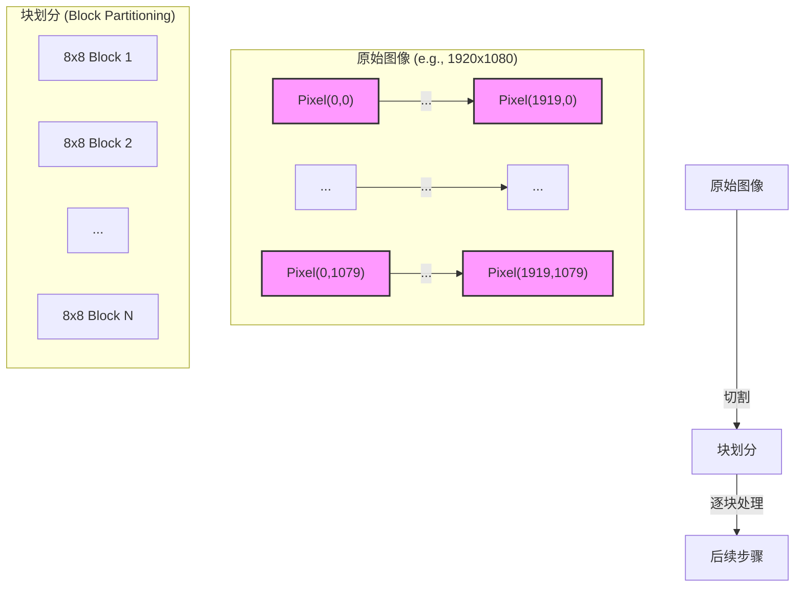
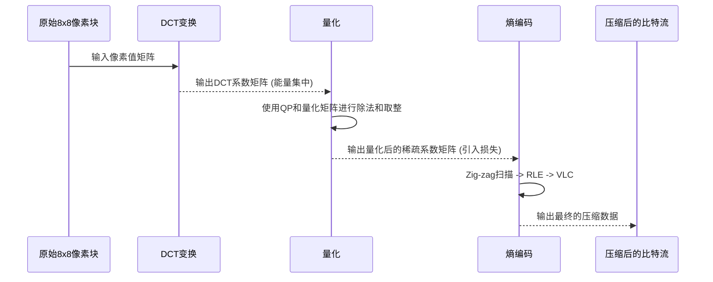

好的，作为一位致力于将复杂知识化繁为简的教育家与作家，我将接续之前的宏大叙事，深入这部精密“压缩引擎”的第一个核心部件。我们已经理解了“为何要压缩”，现在，让我们来揭晓“如何压缩”的第一个答案：如何驯服单张图像内的空间冗余。

---

### 2.2 消除空间冗余：帧内压缩的艺术 (Intra-frame Compression)

在上一节的结尾，我们站在了视频压缩世界的宏伟蓝图前，理解了“预测+残差”这一核心战略。现在，我们将暂时收回眺望远方（时间维度）的目光，聚焦于脚下，专注于解决一个更根本的问题：**如果我们只有一张静止的图像（一帧视频），我们能如何最有效地压缩它？**

这个问题并非凭空而来。在视频流中，它至少在两种关键场景下是必须被正面回答的：
1.  **关键帧（I-frame）**: 视频序列中，总有一些帧需要被独立解码，它们是后续帧进行预测的“锚点”。比如，当你拖动播放进度条时，播放器会寻找最近的那个I-frame开始解码。这些帧不能依赖任何其他帧，必须“自给自足”，因此它们必须使用帧内压缩技术。
2.  **预测失效的区域**: 即使在可以进行时间预测的帧（P-frame或B-frame）中，也可能出现某些区域无法在前一帧中找到好的匹配。例如，一个全新的物体突然进入画面。对于这些区域，编码器会明智地放弃帧间预测，转而使用帧内压缩。

因此，掌握帧内压缩，不仅是理解JPEG等静态图像压缩标准（如JPEG）的关键，更是理解整个现代视频编码框架的基石。这一过程的核心思想，如同我们之前提到的，是将对**“逐点描述”**的执着，转变为对**“区域和模式的描述”**。但这一次，我们将用更严谨的数学和工程语言来解构这个转变。

#### **核心思想：从像素的喧嚣到频率的交响乐**

想象一下，你面前有一幅画，画的是一片宁静的湖水。在像素的世界里，这片湖水是由成千上万个颜色值非常接近的蓝色像素点组成的。直接存储它们，就像是雇佣一个口吃的书记员，让他逐一、重复地念出每个像素的颜色值：“(蓝色值A), (蓝色值B), (蓝色值C)...”，尽管A、B、C几乎完全一样。这无疑是低效的。

我们需要的，是一种全新的语言，一种能描述“模式”而非“个体”的语言。视频编码的先驱们从信号处理领域找到了灵感，特别是**傅里叶分析**。傅里يه分析告诉我们一个惊人的事实：任何复杂的信号（无论是声波还是一行像素），都可以被看作是许多个简单、规则的正弦/余弦波的叠加。

**类比与具象化：图像的交响乐**

让我们把一幅图像想象成一首复杂的交响乐。
*   **像素值**：就像是你在音乐厅里听到的瞬时声压。直接记录下每一毫秒的声压值，数据量会极其庞大，而且这些数值本身并不能直观地告诉你音乐的结构。
*   **频率**：音乐是由不同频率的音符构成的。有沉稳有力的低音提琴（**低频**），构成了音乐的基石；有悠扬的中音大提琴（**中频**），填充了和声；还有清脆嘹亮的小提琴和三角铁（**高频**），增加了细节和瞬态的冲击感。
*   **变换（Transform）**：就像一位拥有“绝对音感”的指挥家。他能在一瞬间听出这首交响乐是由哪些基准音符（哪些频率的波）以多大的音量（振幅）组合而成的。他将嘈杂的声压信号，转换成了一张清晰的乐谱。

图像压缩的“变换”过程，正是扮演了这位指挥家的角色。它将图像从**像素域（Spatial Domain）**——一个由像素值直接构成的、看似混乱的世界，转换到了**频率域（Frequency Domain）**——一个由代表不同模式（频率）的系数构成的、结构清晰的世界。

这个转换的魔力在于：对于绝大多数自然图像而言，其绝大部分的视觉“能量”都集中在低频部分（平滑的区域），而高频部分（剧烈的边缘、噪点）所占的能量则少得多。这就像一首交响乐，大部分时间是由浑厚的低音和中音主导，而尖锐的高音只是点缀。

因此，我们的核心策略诞生了：
1.  **变换**：将图像的能量从空间域集中到频率域的少数几个低频系数上。
2.  **取舍**：重点保留那些能量集中的低频系数，并“不那么在乎”那些能量稀疏的高频系数。

这个策略的实现，依赖于一套精妙的组合拳。让我们逐一拆解这套拳法的四个关键招式。

---

#### **关键组件1：块划分 (Block Partitioning) - 分而治之的智慧**

在对整幅交响乐进行分析之前，指挥家通常会先看分谱，一段一段地研究。同样，对整幅图像（例如1920x1080）直接进行频率变换，不仅计算量大到不可思议，效果也不好。

**问题背景**：像素之间的相关性具有强烈的**局部性**。一个像素的颜色值与它紧邻的像素高度相关，但与屏幕另一角的像素几乎毫无关系。对整幅图像进行一次变换，会试图在无关联的区域之间寻找模式，这既浪费计算力，也冲淡了局部的强相关性。

**解决方案**：分而治之。在进行变换之前，编码器首先将整帧图像切分成一个个不重叠的小方块。在经典的JPEG和早期的视频标准（如H.264/AVC）中，这个基本处理单元通常是**8x8像素**的块。在更现代的标准（如H.265/HEVC, AV1）中，划分方式更加灵活，可以是大到64x64，小到4x4的**编码单元（Coding Unit, CU）**。为了简化讨论，我们以经典的**8x8块**为例。

**影响**：
*   **计算可行性**：将大问题分解为小问题，使得复杂的变换运算可以在有限的硬件资源上快速执行。
*   **效率提升**：每个块内部的像素相关性极高，变换可以更有效地将能量集中起来。
*   **引入副作用**：这种划分也带来了新的问题。如果对每个块的压缩程度不同，块与块的边界处可能会出现明显的视觉不连续，这就是恼人的**块效应（Blocking Artifact）**。现代编码器有专门的**环路滤波（In-loop Filtering）**技术来缓解这个问题，我们后续会探讨。

现在，我们有了成千上万个等待处理的8x8像素块。我们的舞台已经搭好，真正的主角——离散余弦变换（DCT）即将登场。

---

#### **关键组件2：离散余弦变换 (DCT) - 能量的魔法凝聚**

离散余弦变换（Discrete Cosine Transform, DCT）是整个帧内压缩过程的心脏。它是一种与傅里叶变换紧密相关的数学工具，但它特别适合处理像图像块这样的有限、实数信号。

**问题背景**：我们拿到了一个8x8的像素块，它是一个包含64个数字的矩阵。这些数字代表了亮度（或颜色）值。尽管它们内部相关，但数值本身可能从0到255不等，看起来杂乱无章，能量均匀地分布在所有64个位置上。我们如何实现前面提到的“能量集中”？

**解决方案：应用二维DCT变换**

DCT的数学公式本身比较复杂，但我们不必深陷其中。理解它的**输入和输出**以及**物理意义**更为重要。

*   **输入**：一个8x8的**像素值**矩阵。
*   **输出**：一个8x8的**DCT系数**矩阵。

这个输出的系数矩阵具有神奇的特性：
1.  **左上角 (DC系数)**：矩阵的第一个元素 `(0,0)` 被称为**直流（DC）系数**。它的值正比于原始8x8块中所有64个像素的**平均值**。这一个系数，就捕获了整个块的“基础色调”或“平均亮度”。
2.  **其他系数 (AC系数)**：其余的63个系数被称为**交流（AC）系数**。它们描述了像素值在DC平均值基础上的变化和波动。
    *   **靠近左上角**的AC系数，代表了**低频**信息。它们描述的是平缓、大范围的渐变和模式。
    *   **远离左上角，朝向右下角**的AC系数，代表了**高频**信息。它们描述的是尖锐的边缘、细节、纹理甚至是噪点。

**视觉化DCT**
想象一下，每一个DCT系数都对应一个8x8的“基准图案”（Basis Pattern）。原始的8x8像素块，可以被看作是这64个基准图案，各自乘以对应的DCT系数值后，再全部叠加起来的结果。

*(图示：一个8x8 DCT基准图案的可视化。左上角是全白的（代表DC），向右和向下，图案的“波纹”越来越密集、复杂，代表频率越来越高。)*

**影响与“能量集中”的实现**
对于一个包含平滑天空的8x8块，其像素值非常接近。经过DCT变换后，会发生什么？
*   **DC系数**会非常大，因为它代表了那个蓝色区域的平均蓝色值。
*   **低频AC系数**可能会有一些较小的值，代表天空轻微的亮度变化。
*   **绝大多数高频AC系数**会变得非常非常接近于零。因为这块区域根本没有复杂的边缘和纹理。

就这样，DCT像一个高效的管家，将原来散落在64个像素上的视觉信息（能量），整整齐齐地打包，并堆放在了系数矩阵的左上角。这就是**能量集中（Energy Compaction）**的魔力。一个原本看似随机的像素矩阵，变成了一个大部分数值都接近零的高度结构化的系数矩阵。

---

#### **关键组件3：量化 (Quantization) - 有损压缩的艺术之刃**

DCT本身是**可逆**的，是**无损**的。它只是换了一种方式来表达相同的信息，并没有减少数据量。现在，我们终于来到了压缩过程中最关键、也是引入“损失”的一步——**量化（Quantization）**。

**问题背景**：经过DCT后，我们得到一个系数矩阵。虽然高频系数大多接近于零，但它们很少是**精确的零**。例如，一个系数可能是 `0.00138`。为了存储这个精确的浮点数，我们仍然需要很多比特。我们如何大刀阔斧地砍掉这些“无关紧要”的信息，同时又最大限度地保留视觉质量？

**解决方案：有策略的“粗略化”处理**
量化，在本质上是一种**有损的除法和取整运算**。对于DCT系数矩阵中的每一个系数，我们都用一个对应的**量化步长（Quantization Step）**去除它，然后将结果四舍五入到最近的整数。

`Quantized_Coefficient = round(DCT_Coefficient / Quantization_Step)`

这里的关键在于，**Quantization_Step** 不是一个固定的数字。编码器使用一个**量化矩阵（Quantization Matrix）**，它和DCT系数矩阵一样大（例如8x8）。这个矩阵的每一个元素，都为对应位置的DCT系数规定了量化步长。

**类比与具察化：精酿啤酒与工业啤酒**
*   **DCT系数**：就像一个精酿啤酒厂产出的原浆，里面包含了极其丰富、细腻的风味物质（酯类、酚类等），每一种的含量都精确到小数点后好几位。
*   **量化**：就是酒厂决定要生产哪种级别的啤酒。
    *   **高质量（低QP）**：为了酿造“大师臻选”系列，他们会用非常精细的过滤器（小的量化步长）。大部分风味物质都被保留下来，口感层次分明。这就像`round(0.8 / 2) = 0`，但`round(50.2 / 2) = 25`，细节被保留。
    *   **低质量（高QP）**：为了生产大众化的工业啤酒，他们会用非常粗糙的过滤网（大的量化步长）。只有最主要、最强烈的麦芽风味（DC和低频系数）能通过，而那些微妙的果香、花香（高频系数）则被大量舍弃。这就像`round(0.8 / 50) = 0`，`round(50.2 / 50) = 1`，大量信息被“归零”，数据的精度被大幅降低。

**量化矩阵的设计哲学**
量化矩阵的设计蕴含了对人类视觉系统（HVS）特性的深刻理解：**人眼对低频信息（如亮度的缓慢变化）非常敏感，而对高频信息（如非常精细的纹理或噪点）则相对迟钝。**
因此，量化矩阵左上角（对应DC和低频系数）的数值通常较小，意味着量化步长小，“过滤”得更精细。而右下角（对应高频系数）的数值则大得多，意味着量化步长很大，会非常粗暴地将那些本来就很小的高频系数量化为**零**。

**核心旋钮：量化参数 (QP)**
在实际的视频编码中，编码器并不会直接使用一个固定的量化矩阵。它会有一个基准矩阵，然后通过一个单一的参数——**量化参数（Quantization Parameter, QP）**——来整体缩放这个矩阵。
*   **QP值越小**：量化步长越小，保留的细节越多，图像质量越高，但数据量越大（码率高）。
*   **QP值越大**：量化步长越大，舍弃的细节越多，图像质量越差，但数据量越小（码率低）。

QP是视频编码中**控制码率和质量之间平衡的最核心、最直接的工具**。当你在视频导出软件中选择“高质量”或“低码率”时，你主要就是在调整这个QP值。

**影响**：量化是实现高压缩比的**决定性步骤**。它大刀阔斧地将大量人眼不敏感的高频系数直接变成零，从而创造出一个**稀疏矩阵（Sparse Matrix）**——一个绝大部分元素都是零的矩阵。这个稀疏矩阵，为下一步的无损压缩铺平了道路。

---

#### **关键组件4：熵编码 (Entropy Coding) - 无损的最后压榨**

经过量化，我们已经成功地“榨干”了图像中的大部分“水分”（冗余信息）。现在我们手里是一个充满了零的、量化后的DCT系数矩阵。最后一步，就是用最高效的方式，将这个稀疏矩阵打包成最终的比特流。这个过程是**完全无损**的，就像把一堆整理好的文件打成一个zip压缩包。

**问题背景**：我们有一个8x8的矩阵，里面大部分是0。如果还像存储原始像素那样，一个一个地存储这64个数字，那显然是极其浪费的。例如，`[56, -10, 3, 0, 0, 0, 0, 1, 0, 0, ...]`，后面可能跟着几十个0。

**解决方案：组合拳 - Zig-zag扫描, RLE 和 VLC**

1.  **Zig-zag扫描 (Zig-zag Scan)**
    首先，编码器不会按行或按列来读取这个8x8矩阵。它会采用一种巧妙的“Z”字形路径，从左上角的DC系数开始，蜿蜒地扫描到右下角。
    *   **目的**：我们知道，非零的系数主要集中在左上角（低频区），而大量的零则盘踞在右下角（高频区）。Zig-zag扫描的路径，正好能将那些非零的系数尽可能地排在序列的前面，而将连续的零聚集到序列的末尾。
    *   **结果**：我们将一个二维矩阵，转换成了一个一维序列，例如：`[56, -10, 3, 1, ..., 0, 0, 0, ..., 0]`。

2.  **行程编码 (Run-Length Encoding, RLE)**
    对于这个一维序列，特别是末尾大量的连续的零，RLE编码就能大显身手。
    *   **原理**：它不再记录每一个0，而是记录“连续出现了多少个零”。
    *   **示例**：对于序列 `... 3, -2, 0, 0, 0, 0, 1, ...`，RLE会将其表示为类似 `... (3), (-2), (4, 1), ...` 的形式，其中 `(4, 1)` 的意思可以解读为“跳过4个0之后，下一个非零值是1”。对于序列末尾的所有零，甚至可以用一个特殊的“块结束”（End of Block, EOB）符号来表示，后面就不用再传任何数据了。

3.  **可变长编码 (Variable-Length Coding, VLC) / 熵编码**
    最后一步，我们需要为RLE编码后的符号（如单个的系数值，或者“（连续零的个数，下一个值）”这样的组合）分配最终的二进制码。
    *   **核心思想（源自信息论）**：为出现概率高的符号，分配更短的码字；为出现概率低的符号，分配更长的码字。这就像摩尔斯电码中，最常用的字母'E'只有一个点（`.`），而罕见的'Q'是`--.-`。
    *   **常见方法**：**霍夫曼编码（Huffman Coding）**或**算术编码（Arithmetic Coding）**是实现VLC的经典算法。编码器会统计各种符号的出现频率，并生成一个最优的码表。例如，小的DCT系数值（如1, -1, 2）在量化后非常常见，它们会被赋予极短的码字。而大的系数值则非常罕见，会被赋予很长的码字。

**影响**：熵编码是压缩的收尾工作。它在不损失任何信息的前提下，利用数据的统计特性，将量化后的系数序列以尽可能短的比特流形式表示出来，完成了对空间冗余的最后一轮“压榨”。

#### **总结与展望**

在本节中，我们完整地拆解了消除空间冗余的经典流程，这个流程是JPEG图像压缩的核心，也是视频编码中I-frame压缩的基石。

**核心要点回顾：**

1.  **块划分**：将图像分解为小块（如8x8），为局部处理奠定基础。
2.  **离散余弦变换 (DCT)**：将像素块从空间域转换到频率域，实现**能量集中**，将视觉信息汇聚到少数低频系数上。
3.  **量化**：通过有策略的除法和取整，**有损地**降低高频系数的精度，制造大量零，这是实现高压缩比的**关键**。QP是调控质量与码率的核心工具。
4.  **熵编码**：通过Zig-zag扫描、RLE和VLC等**无损**技术，高效地打包稀疏的系数矩阵，生成最终的比特流。

我们已经成功地将一帧静态的图像压缩到了极致。我们学会了如何用“频率的交响乐”来取代“像素的喧嚣”。然而，视频的本质是运动。我们迄今为止的所有努力，都还只是在孤立地看待每一帧。我们像一个画家，学会了如何用最少的笔触画好一幅画，但我们还没学会如何让画面动起来。

视频数据中最大的金矿——**时间冗余**，还静静地躺在那里等待我们去挖掘。我们下一个挑战将是：如何利用帧与帧之间的惊人相似性，实现比帧内压缩高出一个数量级的压缩效率？我们如何从描述“是什么”升级到描述“如何变化”？

这些问题的答案，将引导我们进入视频压缩最激动人心的领域：**帧间预测与运动补偿**。这，将是我们下一节课的壮丽旅程。