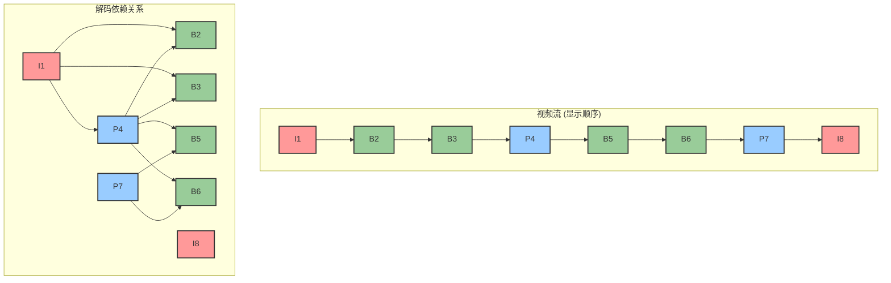

好的，作为一位致力于将复杂知识变得清晰易懂的教育家与作家，我将承接上一节关于帧内压缩的讨论，引领读者进入视频压缩技术中最激动人心、也是最具魔力的领域。我们将从静态的画布转向流动的光影，真正开始驯服时间。

---

### 2.3 消除时间冗余：帧间预测 (Inter-frame Prediction)

在上一节中，我们如同精雕细琢的工匠，学会了如何用最经济的笔触（DCT、量化与熵编码）来描绘一幅独立的画作（I-frame）。我们成功地战胜了空间冗余，将一帧图像内部的重复信息压缩到了极致。然而，视频的灵魂在于运动，在于时间维度上的连续变化。如果我们仅仅满足于将视频看作一本由无数张精美但独立的画片组成的画册，并对每一页都进行独立的压缩，那么我们就错过了视频数据中最大、最诱人的一座金矿——**时间冗余 (Temporal Redundancy)**。

我们面临的新问题是：我们已经能高效地绘制*一帧*，但如何才能高效地绘制*一万帧*？答案令人惊讶：**我们不再去绘制绝大多数的帧，我们去“推算”它们。**

这一思想的转变，是视频压缩从“量变”到“质变”的飞跃。它将我们的角色从一个一丝不苟的“复制画师”，转变为一个洞察运动规律的“动画大师”。本节课，我们将深入探索这套动画大师的“魔法”——运动估计与运动补偿，并结识构成视频流基本句法的三种关键帧类型：I、P、B。

#### **核心思想：从描述“是什么”到描述“如何变化”**

想象一下制作一部儿童手翻书（Flip Book）。书的每一页都画着一个简单的人物，当你快速翻动书页时，人物就动了起来。

*   **旧方法（仅有帧内压缩）**：如同一个最没有经验的画师，他在每一页上都重新、完整地绘制整个人物和背景。即使背景从未改变，他也一遍又一遍地重复劳动。这虽然能实现动画效果，但效率极其低下，耗费了大量的墨水和时间。

*   **新方法（帧间预测）**：一位聪明的动画师采用了不同的策略。
    1.  他在第一页（**参考帧**）上，认真地画好了完整的场景和人物。
    2.  在画第二页时，他拿出了一张半透明的描图纸，覆盖在第一页上。他观察到，人物只是向右平移了一小步。于是，他没有重画整个人物，而是在描图纸上只记录下了一个简单的指令：“**将人物向右移动5毫米**”。
    3.  他可能还会发现，人物的手臂姿势有微小的变化。于是他又补充了一条指令：“**在新的位置上，将手臂的线条擦掉，重画成这样**”。
    4.  对于完全没有变化的背景，他甚至不需要下任何指令。

这位聪明的动画师所做的，正是帧间预测的核心。他没有去描述第二页“是什么”，而是描述了它与第一页相比“**如何变化**”。这个“变化”主要由两部分构成：
1.  **运动 (Motion)**：“向右移动5毫米”——这就是**运动矢量 (Motion Vector)**。
2.  **修正 (Correction)**：“重画手臂”——这就是**残差 (Residual)**，即运动预测之后与真实图像的差异。

显而易见，记录“一个运动指令 + 一点点修正”所需要的信息量，要远远小于“重新绘制整幅画面”。这就是消除时间冗余所带来的惊人收益。

---

#### **关键机制：运动估计与运动补偿 (ME & MC)**

“找到物体的运动并进行补偿”这个想法听起来直观，但计算机如何像人眼一样“看”到运动呢？答案是一个严谨、计算密集但极其有效的工程流程：运动估计（Motion Estimation）与运动补偿（Motion Compensation）。这套组合拳是所有现代视频编码标准（如H.264, H.265）的心脏。

让我们将这个过程想象成一场精密的侦探游戏。

**1. 运动估计 (Motion Estimation, ME) - 编码器的侦探工作**

编码器是这场游戏的主导者，它手头有两份关键“证物”：
*   **当前帧 (Current Frame)**：需要被编码的这一帧图像。
*   **参考帧 (Reference Frame)**：已经编码完成的、存储在内存中的一帧或多帧图像（通常是前一帧）。

侦探（编码器）的目标是：为当前帧中的每一个**宏块 (Macroblock)**（通常是16x16或更灵活大小的块），在参考帧中找到一个“最佳匹配”的区域。

**【工作流程】**

1.  **分块**：首先，将当前帧切分成一系列不重叠的宏块。我们以一个16x16的宏块为例。

2.  **设定搜索范围 (Search Window)**：侦探不会在整个参考帧中进行大海捞针式的搜索。它会在参考帧中，以当前宏块对应的位置为中心，划定一个合理的“搜索区域”。这个区域的大小决定了编码器能检测到的运动范围。

3.  **匹配与比对**：这是最核心的计算环节。侦探会拿着当前宏块，像移动一个图章一样，在搜索区域内逐个像素地移动。在每一个可能的位置上，它都会计算当前宏块与参考帧对应区域的“差异度”。
    *   **如何衡量“差异度”？** 有多种算法，最常用也最容易理解的是**绝对差值和 (Sum of Absolute Differences, SAD)**。它将两个块中对应位置的像素值之差的绝对值全部加起来。`SAD = Σ |Current_Pixel - Reference_Pixel|`。SAD值越小，说明两个块越相似。

4.  **确定最佳匹配**：在遍历了整个搜索区域后，侦探会找到那个使SAD值最小的位置。这个位置上的块，就被认为是“最佳匹配块”。

5.  **生成运动矢量 (Motion Vector, MV)**：从当前宏块在当前帧的原始位置，指向这个最佳匹配块在参考帧中的位置的那个**位移箭头**，就是**运动矢量**。它通常用一个二维坐标 `(dx, dy)` 来表示，指明了水平和垂直方向的位移。

**【Case Study: 一颗移动的足球】**

*   **当前帧**：一个16x16的宏块正好完整地框住了足球。
*   **参考帧**：是1/30秒前的画面，足球位于左侧。
*   **ME过程**：编码器在参考帧的搜索区域内进行匹配，发现当它将搜索位置移动到 `(x-40, y-5)` 时（即向左移动40像素，向上移动5像素），SAD值达到了最小。
*   **ME的输出**：它不会存储当前宏块的64个像素值，而是生成了一个运动矢量 **MV = (+40, +5)**。这个MV的含义是：“解码器，请到参考帧 `(x-40, y-5)` 的位置去取一个16x16的块，它就是我对当前块的预测。”

**2. 运动补偿 (Motion Compensation, MC) - 基于指令的重建**

运动估计是编码器端的“搜索”过程。运动补偿则是利用这个搜索结果，在**编码器和解码器两端**共同进行的“重建”过程。

*   **在编码器端**：
    1.  编码器使用刚刚计算出的MV，从参考帧中取出“最佳匹配块”，生成一个**预测块 (Predicted Block)**。
    2.  然后，它用**原始宏块**减去这个**预测块**，得到**残差块 (Residual Block)**。`Residual = Original - Predicted`。
    3.  **关键**：编码器接下来真正需要编码和发送的，不再是原始宏块，而是那个描述运动的**运动矢量 (MV)**，以及这个能量极其稀疏、大部分值都接近零的**残差块**。
    4.  这个残差块本身也是一个像素块，编码器会再次动用我们在2.2节学到的所有工具（DCT、量化、熵编码）来对其进行极致的压缩。由于一个好的预测会让残差非常小，所以压缩这个残差所需的数据量也极小。

*   **在解码器端**：
    解码器的工作就像一个严格执行指令的工人。它收到的指令包括：
    1.  运动矢量 `MV = (+40, +5)`。
    2.  经过压缩的残差数据。
    它的操作流程是：
    1.  解码残差数据，得到残差块。
    2.  从它已经解码好的参考帧中，根据MV `(+40, +5)` 找到指定的参考位置，取出参考块，形成预测块。
    3.  将预测块与残差块相加，`Reconstructed Block = Predicted Block + Decoded Residual`。
    4.  至此，解码器就完美地重建了原始宏块，而整个过程中传输的数据量仅仅是（一个MV + 一个被高度压缩的残差）。

```mermaid
sequenceDiagram
    participant Encoder as 编码器
    participant Bitstream as 比特流
    participant Decoder as 解码器

    box "编码过程 (Encoder)"
        Encoder->>Encoder: 1. 对当前块进行运动估计(ME)<br>在参考帧中搜索最佳匹配
        Encoder->>Encoder: 2. 得到运动矢量(MV)
        Encoder->>Encoder: 3. 执行运动补偿(MC)<br>生成预测块P
        Encoder->>Encoder: 4. 计算残差 R = Original - P
        Encoder->>Encoder: 5. 压缩MV和残差R
    end

    Encoder->>Bitstream: 6. 发送压缩后的(MV, R)
    Bitstream->>Decoder: 7. 接收压缩后的(MV, R)

    box "解码过程 (Decoder)"
        Decoder->>Decoder: 8. 解码得到MV和残差R
        Decoder->>Decoder: 9. 在自己的参考帧中<br>根据MV执行运动补偿(MC)<br>生成预测块P'
        Decoder->>Decoder: 10. 重建块 = P' + R
    end
```

这套 ME/MC 的机制，构成了帧间预测的基石，它系统性地将视频中巨大的时间冗余转换为了少量的运动信息和微弱的残差信号，实现了远超帧内压缩的压缩效率。

---

#### **关键组件：I、P、B 帧类型 - 视频流的语法结构**

现在我们拥有了强大的帧间预测工具，但我们不能滥用它。如果每一帧都依赖于前一帧，那么这个依赖链条会无限延长，带来两个致命问题：1) 一旦中间任何一帧的数据出错，错误会像多米诺骨牌一样传递下去，导致后续所有画面崩溃；2) 如果用户想从视频的中间开始看（拖动进度条），解码器将无从下手，因为它没有“第一页”作为参考。

为了解决这些问题，视频编码引入了三种不同类型的帧，它们像一篇文章中的不同标点和句式，共同构成了视频流的语法。



**1. I 帧 (Intra-coded Frame) - 关键帧，独立的“章节首页”**

*   **功能**：I帧是视频序列中的“定海神针”。它不依赖于任何其他帧，完全通过我们在2.2节学习的**帧内压缩**技术进行编码。你可以把它看作一张被高度压缩的JPEG图像。
*   **角色**：
    *   **随机访问点 (Random Access Point)**：当你在播放器上拖动进度条时，播放器会寻找目标时间点之前的第一个I-frame，并从那里开始解码。没有I-frame，就无法实现“空降”式的播放。
    *   **错误恢复的起点**：I-frame斩断了预测链条。如果网络传输中出现丢包，导致某个P帧或B帧解码错误，这个错误最多只会影响到下一个I-frame之前。当解码器遇到新的I-frame时，它可以“重置”状态，从一个干净、正确的基础上重新开始。
*   **代价**：由于它只利用空间冗余，不利用时间冗余，因此I-frame是三种帧类型中**压缩率最低、体积最大**的。

**2. P 帧 (Predicted Frame) - 前向预测帧，忠实的“追随者”**

*   **功能**：P帧是帧间预测的“主力军”。它以一个**过去**的I-frame或P-frame作为参考，通过运动估计和运动补偿来编码。它只进行**前向预测 (Forward Prediction)**。
*   **角色**：P-frame大大提高了压缩效率。它只存储了相对于前一个参考帧的运动矢量和残差，因此其体积通常远小于I-frame。一个典型的P-frame可能只有I-frame大小的1/3甚至更少。
*   **依赖性**：P-frame的解码**强依赖**于其参考帧。如果它的参考帧丢失或损坏，那么这个P-frame以及所有依赖于它的后续P-frame都将无法正确解码，直到下一个I-frame出现。这就是所谓的**错误传播 (Error Propagation)**。

**3. B 帧 (Bi-predictive Frame) - 双向预测帧，运筹帷幄的“策略家”**

*   **功能**：B-frame是压缩技术中的一个妙笔，也是最复杂的帧类型。它不仅可以像P-frame一样参考一个**过去**的帧，还可以参考一个**未来**的帧进行预测。这听起来有点违反直觉，我们稍后解释。
*   **角色**：B-frame将压缩效率推向了极致。为什么双向预测更好？
    1.  **更优的匹配**：想象一个物体从左向右移动，中间被一个柱子短暂遮挡。对于被遮挡的那几帧，仅从过去（物体还没被遮挡）来预测会很困难。但如果能同时参考未来（物体已经从柱子后出来了），编码器就能更准确地“插值”出物体在中间的位置，从而得到更小的残差。
    2.  **新出现的内容**：对于一个刚刚进入画面的物体，前向预测找不到任何参考。但后向预测（参考未来帧）却可以完美地找到它。
    3.  **平均预测**：B-frame甚至可以对从过去和未来两个方向得到的预测块进行加权平均，进一步减小预测误差。
*   **代价与实现**：
    *   **延迟 (Latency)**：为了能够参考“未来”的帧，编码器和解码器必须改变帧的处理顺序。例如，显示顺序是 `I -> B -> P`，但编码和解码的顺序必须是 `I -> P -> B`，因为解码B帧需要P帧作为参考。这种帧重排（Frame Reordering）引入了额外的缓冲和延迟，因此在实时通信（如视频会议）中需要谨慎使用。
    *   **计算复杂度**：进行双向搜索，计算量自然更大。
    *   **结果**：由于预测极其精准，B-frame的残差通常最小，因此它的体积是三种帧中**最小**的，压缩率最高。

---

#### **GOP 结构 (Group of Pictures) - 编排压缩与访问的节奏**

I、P、B三种帧不是随意排列的，它们被组织成一种称为**图像组 (Group of Pictures, GOP)** 的重复性结构。一个GOP通常由一个I-frame开始，后跟一系列P-frame和B-frame。

**GOP的两个关键参数：**

1.  **GOP长度 (GOP Length / I-frame Interval)**：一个GOP中包含的总帧数，或者说两个I-frame之间的距离。例如，在30fps的视频中，GOP长度为30意味着每秒有1个I-frame。
2.  **GOP结构 (GOP Structure)**：两个I-frame之间，P-frame和B-frame的排列模式。例如，`IBBPBBP...` 是一种常见的结构，表示一个I帧后面跟着两个B帧，然后是一个P帧，如此循环。

**GOP的选择，是一场深刻的权衡艺术，它直接影响着视频的核心特性：**

*   **压缩效率**
    *   **长GOP**：I-frame的占比低，P-frame和B-frame的占比高。由于P/B帧的压缩率远高于I-frame，长GOP能实现**更高**的整体压缩率，得到更小的文件。
    *   **短GOP**：I-frame出现得更频繁，导致整体压缩率**较低**。

*   **随机访问速度 (Seek Speed)**
    *   **长GOP**：如果你想跳转到一个位于GOP末尾的帧，解码器必须从GOP头部的I-frame开始，依次解码所有的P-frame和B-frame，直到你想要的那一帧。GOP越长，这个过程越慢，seek的延迟就越高。
    *   **短GOP**：任何跳转操作最多只需要解码一个很短的帧序列，因此seek速度**非常快**。

*   **容错性 (Error Resilience)**
    *   **长GOP**：一个传输错误会影响GOP内从错误点到下一个I-frame之间的所有帧，潜在的破坏范围更广。
    *   **短GOP**：错误的影响范围被限制在一个较小的GOP内，视频能更快地“恢复正常”。

**【应用场景的权衡】**

*   **视频点播 (VOD) / 归档存储**：在这种场景下，极致的压缩率是首要目标，用户对几百毫秒的seek延迟并不敏感。因此，通常会使用**非常长的GOP**（例如，长达10秒，即300帧）。
*   **直播 / 实时通信 (Live Streaming / RTC)**：低延迟和快速的频道切换（本质上是seek）是关键。观众无法容忍长时间的卡顿或花屏。因此，直播流通常采用**极短的GOP**（例如，1-2秒，即30-60帧），甚至在某些超低延迟场景下完全禁用B-frame (`IPPP...`结构)。

GOP的选择没有绝对的好坏，它是编码器根据应用需求，在**压缩效率**、**访问速度**和**鲁棒性**之间做出的战略决策。

---

#### **总结与展望**

在本节中，我们深入探索了视频压缩的灵魂——时间冗余的消除。我们从一个简单的手翻书类比开始，最终解构了驱动现代视频编码的核心引擎。

**核心要点回顾：**

*   **核心思想转变**：从编码每一帧“是什么”，转变为编码它相对于参考帧“如何变化”。
*   **关键机制**：
    *   **运动估计 (ME)**：编码器通过块匹配算法（如SAD），在参考帧中为当前块寻找最佳匹配，并生成**运动矢量 (MV)**。
    *   **运动补偿 (MC)**：编码器和解码器利用MV从参考帧生成预测，最终需要编码和传输的只是**MV + 压缩后的残差**。
*   **关键组件（帧类型）**：
    *   **I-frame**: 独立的锚点，提供seek和错误恢复，但体积最大。
    *   **P-frame**: 参考过去的帧，高效的前向预测，体积居中。
    *   **B-frame**: 参考过去和未来，提供极致的压缩率，但引入延迟，体积最小。
*   **GOP结构**：通过设定I、P、B帧的排列模式和I帧间隔，在压缩率、seek速度和容错性之间进行关键的权衡。

我们已经理解了视频压缩是如何通过预测来工作的。无论是利用空间相邻像素的帧内预测，还是利用时间相邻帧的帧间预测，其范式都是“预测+残差”。然而，这引出了一个更深层次的、关于“决策”的问题。

对于视频中的任何一个宏块，编码器都面临着一个选择：
*   是使用帧内预测模式（像I-frame那样）？
*   还是使用帧间预测模式（像P-frame那样）？
*   如果使用帧间预测，应该选择哪个参考帧？运动矢量搜索到什么精度就停止？
*   应该使用多大的QP来量化残差？

这些决策的优劣，直接决定了最终压缩视频的质量和码率。这不再是一个简单的“对/错”问题，而是一个复杂的优化问题。如何做出最优的编码决策？这便是**率失真优化（Rate-Distortion Optimization, RDO）**理论要解决的核心问题，也是区分一个“合格”编码器和一个“卓越”编码器的分水岭。这，将是我们下一段旅程的起点。