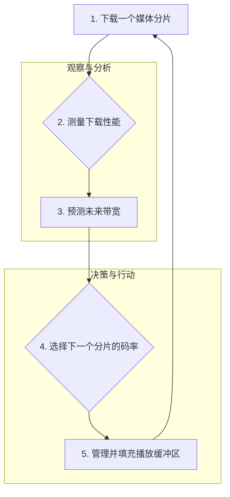

好的，我将扮演这位世界级的教育家与作家，以深入浅出且引人入胜的方式，为您撰写这一节课程内容。

---

### 第四章：播放器的智能 · 客户端决策与体验优化

#### 4.1 根本问题：播放器如何智能地选择“正确”的码率？

你好，欢迎来到第四章。在前面的章节里，我们已经搭建好了舞台：服务器精心准备了多份“剧本”（不同码率的视频分片），并通过一份“节目单”（Manifest文件）告知了客户端所有可用的选项。至此，服务器的工作基本完成。现在，聚光灯将完全打在舞台的中央——那个我们既熟悉又陌生的角色：**播放器**。

在流媒体的早期时代，播放器更像是一个谦卑的信使，其任务简单而直接：接收服务器发送过来的单一视频文件，然后按顺序播放。它没有选择，也无需思考。然而，随着自适应码率流（ABR）技术的诞生，一场深刻的革命悄然发生。播放器不再是那个被动的文件接收者，它被赋予了前所未有的权力和责任，**从一个忠实的“执行者”蜕变为一个运筹帷幄的“指挥官”**。

这一章，我们将深入播放器的大脑，去探寻那个最根本、也最迷人的问题：在一个瞬息万变的网络世界里，播放器究竟是如何做出那个“正确”的决策，为我们带来流畅且高清的观看体验的？

---

##### **角色的伟大转变：从“水管工”到“智能水利调度员”**

要理解播放器角色的转变，让我们先回到过去，看看“渐进式下载”（Progressive Download）的时代。

**问题背景：旧世界的“水管工”模型**

想象一下，你想给家里的游泳池注满水。在渐进式下载的模式下，这就好比你只有一根水管连接着水库。你打开阀门，水（视频数据）就开始源源不断地流过来。播放器就像一个简单的水管工，它的工作就是确保水管的另一头对准游泳池，然后等待。

这个模型简单直观，但也极其脆弱。如果水库的水压（网络带宽）突然下降，水流就会变细，注满游泳池的时间就会大大延长。在视频播放中，这意味着播放进度会追上下载进度，然后——你看到了那个熟悉的、令人抓狂的旋转加载图标。我们称之为“缓冲”或“卡顿”（Buffering/Rebuffering）。这位“水管工”对此无能为力，它只能被动地等待水压恢复。

**解决方案的诞生：ABR与“智能水利调度员”**

自适应码率流（ABR）技术彻底改变了游戏规则。它相当于对供水系统进行了一次颠覆性升级。现在，水库不再只提供一根单一的巨大水管，而是提供了多根粗细不一的水管，分别对应着超高清（大水管）、高清（中水管）、标清（小水管）等不同质量的水流。

在新的体系下，播放器不再是那个只能盯着一根水管的水管工，它摇身一变，成了一位**智能水利调度员**。它的控制面板上显示着所有可用的水管（码率），同时，它还配备了一系列精密的传感器，用于实时监测当前的水压（网络带宽）和游泳池的水位（播放缓冲区）。

它的核心任务不再是“等待”，而是“决策”。它需要基于实时数据，不断地自问并回答一系列复杂问题：

*   “根据过去几秒的水压来看，未来一段时间的水压可能会是多少？”
*   “泳池里还剩多少水，够用多久？”
*   “我应该切换到更粗的水管以提升体验，还是为了安全起见，继续使用现在这根，甚至换一根更细的？”

**关键影响：智能的迁移**

这个转变的本质，是将流媒体体验优化的核心智能，从庞大、遥远的服务器端，**迁移到了离用户最近的客户端**。服务器负责“提供可能性”，而播放器负责“做出最优选择”。这种架构赋予了流媒体前所未有的弹性和适应性，使其能够在今天这个复杂多变、从高速光纤到拥挤的4G/5G信号无处不在的网络环境中生存下来。播放器，正是这场革命的中心英雄。

---

##### **决策的核心：播放器的“观察-决策-行动”循环**

成为一名“智能调度员”后，播放器是如何工作的呢？它并不是凭感觉行事，而是遵循一个严谨、持续、高速运转的决策循环。这个循环是所有现代ABR算法的基石，我们可以将其描绘成一个永不停歇的“心跳”。

让我们将这个循环拆解开来，看看这位调度员在每一个“心跳周期”里都做了些什么。

**1. 下载一个媒体分片 (Download a Media Segment)**

一切始于行动。播放器首先会根据Manifest文件中的信息，选择并下载一个视频分片（Segment）。这个分片通常是2到10秒的视频内容。对于第一次下载（启动时），它通常会选择一个较低的码率以求快速启动。

**2. 测量下载性能 (Measure Download Performance)**

分片下载完成后，播放器立即进行复盘。它会精确记录下载这个分片所花费的时间和分片的大小。通过一个简单的公式：

`瞬时吞吐量 (Throughput) = 分片大小 (Bytes) / 下载时间 (Seconds)`

它得到了一个关键的原始数据：刚刚这次下载的“速度”。这就像我们的水利调度员记录下用某根水管注满一小桶水花了多长时间，从而计算出刚才那一刻的水流速度。

**3. 预测未来带宽 (Predict Future Bandwidth)**

这是整个循环中最具挑战性、也最体现“智能”的一步。网络环境是出了名的“喜怒无常”。刚刚测得的下载速度可能只是昙花一现的高峰，也可能是暂时的低谷。如果播放器仅仅基于这一个孤立的数据点来做决策，那将是极其鲁莽的。

这好比一位经验丰富的司机在高速公路上驾驶。他不会只盯着当前的瞬时速度表，他还会综合考虑过去几分钟的平均车速、前方路况的可见变化（如乌云、车流密度）来预判接下来应该以什么速度行驶。

同样，一个成熟的播放器算法会采用更复杂的模型来**预测**未来的网络带宽。常见的方法包括：

*   **移动平均法 (Moving Average):** 计算最近几次下载速度的平均值，以平滑掉单个异常值带来的“噪声”。
*   **指数加权移动平均 (EWMA):** 一种更高级的平均法，它给予最近的数据点更高的权重，认为“越近的过去，越能代表未来”。
*   **谐波平均法 (Harmonic Mean):** 这种方法对低速值更敏感，因此在评估多段下载速度时，能更保守、更安全地反映出网络的瓶颈。

**关键在于，播放器试图从充满噪声的历史数据中，找出一个相对稳定且可靠的未来带宽预测值。** 这是一个从“测量过去”到“预测未来”的认知飞跃。

**4. 选择下一个分片的码率 (Select Next Segment's Bitrate)**

手握着对未来带宽的预测值，播放器终于可以做出核心决策了。它会再次查阅Manifest文件，看到所有可供选择的码率档位（比如 500kbps, 1Mbps, 2.5Mbps, 5Mbps...）。

选择的基本原则是**审慎的乐观**：

`选择的码率 (Bitrate) < 预测的带宽 (Bandwidth)`

为什么是“小于”而不是“等于”？因为需要一个**安全边际 (Safety Margin)**。网络预测总有误差，留出一些余量（通常是预测带宽的10%-25%）可以确保即使网络出现轻微波动，分片也能在规定时间内（即分片的时长内）下载完成，从而避免缓冲区枯竭。

例如，如果播放器预测未来带宽为3Mbps，它可能不会贸然去请求2.5Mbps的最高档位，而是会选择一个更安全的，比如1Mbps或2.5Mbps，具体取决于其算法的“激进”或“保守”程度。

**5. 管理并填充播放缓冲区 (Manage the Buffer)**

播放器下载下来的分片并不会立即播放，而是先存放在一个叫做“播放缓冲区”（Buffer）的内存区域里。这个缓冲区是播放器对抗网络波动的最后一道防线。

想象一下，这个缓冲区就像是游泳池本身。只要池里有水，即使外界供水暂时中断，游泳的人（观众）也毫无察觉。

*   **缓冲区的目标：** 播放器会努力维持一个健康的目标缓冲时长，比如30-60秒。这意味着它会持续下载新的分片，直到缓冲区里积攒了足够的内容。
*   **缓冲区的两面性：** 一个大的缓冲区可以极大地增强抵御网络抖动的能力，降低卡顿风险。但它也有副作用：当网络状况**变好**时，由于缓冲区已满，播放器无法立即请求更高码率的分片，导致用户不得不在低画质下观看一段时间，直到缓冲区消耗掉一部分。这被称为“buffer-full”问题，也是现代ABR算法需要权衡的难题之一。

完成这五步之后，一个决策周期就结束了。但播放器的工作远未结束，它会立即回到第一步，下载下一个分片，周而复始，为我们的每一次观看体验保驾护航。

---

##### **成功的标尺：衡量用户体验（QoE）的关键指标**

我们已经知道了播放器是如何工作的，但我们如何评价它工作得“好”还是“坏”呢？在工程领域，无法被量化的东西就无法被优化。因此，业界定义了一系列关键性能指标（KPIs）来量化用户观看视频的体验，这个概念被称为 **Quality of Experience (QoE)**。

这些KPIs就是播放器智能算法的“考试成绩单”。主要的科目有三门：

**1. 启动延迟 (Startup Delay)**

*   **定义：** 从用户点击播放按钮到视频第一帧画面出现所花费的时间。
*   **类比：** 这就像你点燃一根烟花的引信，从点燃到烟花“嘭”地一声在空中绽放的等待时间。时间越短，那种即时的满足感就越强。
*   **技术权衡：** 启动延迟是一个与初始码率选择直接相关的指标。播放器可以选择一个非常低的码率（比如200kbps）作为“开场”，这样第一个分片会下载得飞快，启动延迟极低。但代价是开头的几秒钟画质会很模糊。反之，如果以一个高码率启动，画面清晰，但用户等待的时间就会更长。研究表明，启动延迟超过2秒，用户的流失率就会显著增加。

**2. 卡顿率 (Rebuffering Ratio)**

*   **定义：** 在整个播放过程中，用于缓冲的时间占总播放时长的百分比。
*   **类比：** 这是一场音乐会中，因为设备故障而导致演出中断的尴尬沉默时间。它是用户体验的头号杀手，是最不能被容忍的“事故”。
*   **技术权衡：** 零卡顿是所有ABR算法追求的“圣杯”。为了避免卡顿，算法可能会变得非常保守，宁愿长时间停留在较低的码率，也不敢轻易尝试可能导致下载失败的高码率。一个理想的算法应该能在尽可能不发生卡顿的前提下，最大化地提升画质。

**3. 画质 / 平均码率 (Video Quality / Average Bitrate)**

*   **定义：** 整个观看过程中，播放的视频码率的平均值。在同等编码效率下，更高的平均码率通常意味着更清晰、更细腻的画面。
*   **类比：** 如果把观看体验比作一次公路旅行，平均码率就是你的平均时速。更高的平均时速意味着你更快、更高效地享受了旅途的风光。
*   **技术权衡：** 这是用户最直观的感受。没有人想在今天的大屏幕上观看马赛克一样的视频。提升平均码率是算法的核心目标之一。但这往往与降低卡顿率的目标相冲突。一个激进的算法会频繁地尝试提升码率，这固然能带来更高的平均码率，但同时也增加了因网络波动而预测失败、导致卡顿的风险。

这三个核心KPIs构成了一个经典的**“不可能三角”**：**你很难同时将启动延迟降到最低、卡顿率压至零、并且把平均码T率提到最高。** 不同的播放场景需要不同的优化策略。例如，对于短视频，快速启动可能比画质更重要；而对于一部万众期待的电影大片，用户可能愿意多等几秒，以换取从头到尾的极致高清体验。

---

##### **总结与展望：永无止境的优化之路**

在这一节中，我们共同见证了播放器从一个简单的执行者到智能决策者的华丽转身。我们深入其内部，理解了它赖以生存的核心决策循环：**下载、测量、预测、选择、缓冲**。最后，我们学会了用三个关键的QoE指标——**启动延迟、卡顿率、平均码率**——来评判这位“智能调度员”的工作表现。

我们现在知道了播放器“如何”工作，但这引出了一系列更深层次、更激动人心的问题：

1.  **预测的极限在哪里？**既然带宽预测是核心，当简单的数学模型达到瓶颈时，我们是否可以引入更强大的武器，比如机器学习，让播放器通过海量数据“学会”预测不同网络环境下的行为模式？
2.  **“正确”的唯一性？**对于不同的内容（体育直播 vs. 电影）、不同的设备（手机 vs. 电视）、不同的用户网络环境（WiFi vs. 5G），“最优”的码率选择策略是否应该是相同的？我们能否设计出“情景感知”的自适应算法？
3.  **孤军奋战的终结？**目前，播放器像一个孤独的决策者，仅凭自己客户端的“一亩三分地”来推断整个网络的状况。如果客户端能与服务器、甚至与网络运营商（CDN）进行更深度的信息交互，我们是否能开创一个“协同决策”的新纪元，从而彻底改变流媒体的游戏规则？

这些问题，正是当前Web媒体技术领域最前沿、最活跃的研究方向。它们也为我们接下来的学习之旅，指明了激动人心的方向。现在，请带着这些思考，让我们继续前行。