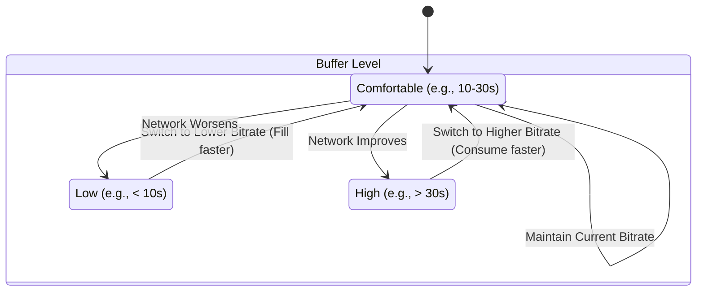

好的，作为一位专精于将复杂技术概念化繁为简的教育家与作家，我将为您精心撰写这一节课程。我将通过生动的类比、清晰的逻辑链条和富有启发性的思考，带领读者深入探索播放器智能决策的核心——缓冲区管理与码率选择的艺术。

***

# 4.3 工具二：缓冲区管理与码率选择逻辑

在上一节中，我们探讨了播放器如何像一位气象学家一样，通过“带宽预测”来窥探未来网络的天气。但即便拥有最精准的天气预报，我们也无法阻止突如其来的暴雨或干旱。同样，在变幻莫测的互联网世界里，预测终究是预测，总有意外发生。那么，当网络状况的“突发天气”来临时，播放器该如何确保我们的观影体验“风雨无阻”呢？

这就是我们本节要探讨的主角——**缓冲区（Buffer）**。它不仅是播放器对抗网络抖动的“蓄水池”，更是一位时刻监控着系统健康状况的“水库管理员”。我们将一同揭开它从一个被动的“安全垫”演变为一个主动的“决策者”的 fascinating 旅程，并理解现代播放器如何将它与带宽预测相结合，上演一出精妙的“平衡之舞”。

## 1. 缓冲区的存在哲学：未雨绸缪的“数字蓄水池”

在深入探讨策略之前，我们必须先回答一个根本性问题：为什么需要缓冲区？如果没有它，视频播放会是怎样一番景象？

**问题背景：互联网的“尽力而为”与视频流的“刻不容缓”**

想象一下，你正在观看一场激动人心的直播球赛。每一个数据包，都像是从遥远的服务器球场踢出的一脚球，需要精准、连续地送达你面前的屏幕“球门”。然而，互联网并非一条为你专设的平坦高速公路。它是一个公共、开放、遵循“尽力而为”（Best-Effort）原则的网络。这意味着网络中的路由器和交换机只会尽其所能地转发你的数据包，但不提供任何关于延迟、抖动或带宽的保证。

这导致了两个致命问题：
1.  **延迟抖动（Jitter）**：数据包的到达间隔是不均匀的。有的来得快，有的因为网络拥堵绕了远路，来得慢。它们并非像工厂流水线上的零件那样匀速抵达。
2.  **带宽波动（Bandwidth Fluctuation）**：你的可用网络带宽是实时变化的。可能前一秒还在高速下载，后一秒因为邻居开始打游戏或者运营商网络调整，速度骤降。

如果播放器采取“即收即播”的策略，那么这种网络世界的“颠簸”将毫无保留地传递给用户。你会看到画面频繁地“一帧一顿”，就像一个口吃的人在艰难地讲述故事。当网络严重拥堵时，数据包甚至会“断供”，播放器无米下锅，只能被迫停下来，屏幕上出现那个我们都无比熟悉又痛恨的“加载”图标——这就是**卡顿（Stalling / Rebuffering）**。

**解决方案：缓冲区的诞生**

为了解决这个“供给”与“消费”不匹配的矛盾，工程师们引入了一个绝妙的中间层——**缓冲区**。

我们可以用一个极其贴切的类比来理解它：**一个家庭供水系统**。

*   **自来水厂的供水管网 (互联网)**：它的供水压力 (带宽) 会因高峰用水时段 (网络拥堵) 而波动，有时强劲，有时孱弱。
*   **你家的水龙头 (视频播放)**：你需要它能源源不断、稳定地流出水来 (流畅播放)。
*   **屋顶的蓄水池 (缓冲区)**：这正是缓冲区的角色。

这个蓄水池的作用是什么？它在供水管网压力大的时候（网络状况好），提前储存足够的水。当供水压力突然下降（网络变差）时，水龙头并非直接从供水管取水，而是从这个蓄水池里取水。只要蓄水池里还有水，即使主管道暂时断供，你家的水龙头依然可以正常出水。

  *（概念图：水库类比缓冲区，上游是波动的网络输入，下游是稳定的播放输出）*

将这个类比翻译成技术语言：

*   **蓄水池里的水量**，就是**缓冲区里存储的未播放的视频时长**（例如，缓冲了30秒的视频内容）。
*   **向蓄水池注水的过程**，就是**播放器从服务器下载视频切片（Chunk）并存入内存的过程**。
*   **从水龙头放水的过程**，就是**播放器解码并渲染视频，呈现给用户的过程**。

**核心影响：解耦与平滑**

缓冲区的出现，其最关键的影响在于**“解耦”（Decoupling）**。它成功地将**“下载过程”**与**“播放过程”**分离开来。播放器不再依赖于下一帧数据是否“此刻”已经到达，而是依赖于缓冲区这个“安全库存”是否充足。这块“安全垫”有效地吸收了网络的抖动和短暂的带宽下降，像一个精密的滤波器，将崎岖不平的网络输入，平滑为稳定流畅的播放输出。

至此，缓冲区扮演的还是一个“被动防御者”的角色。但很快，开发者们意识到，这个“蓄水池”的水位本身，就是一个极其宝贵的信号。

## 2. 从被动到主动：基于缓冲区的自适应策略 (BBA)

如果说缓冲区的存在是流媒体播放的第一次革命，那么利用缓冲区水平来动态调整码率，则是其走向“智能”的第二次飞跃。我们不再仅仅满足于“不卡顿”，我们还希望在不卡顿的前提下，获得尽可能高的画质。

**问题背景：静态缓冲的局限**

早期的播放器虽然有缓冲区，但码率的选择是相对静态的，或者需要用户手动切换。这种方式显然不够智能。如果网络状况持续恶化，再大的“蓄水池”也终有耗尽的一天。反之，如果网络状况极好，播放器却依然用低码率填充缓冲区，那无异于守着金山吃窝头，浪费了用户的高速网络和高清屏幕。

我们需要一种机制，让播放器能根据当前的“系统健康状况”自动做出最优决策。而什么最能反映系统的健康状况呢？正是我们的“蓄水池水位”——缓冲区时长。

**解决方案：基于缓冲区的自适应策略（Buffer-Based Adaptation, BBA）**

BBA策略的核心思想简单而优雅：**将缓冲区水平作为网络状况的“晴雨表”，并据此调整下载策略。**

*   **当水位过低（进入警戒区）**：这强烈暗示着“消耗速度”大于“补给速度”。也就是说，网络下载速度跟不上播放速度了。此时，首要任务是“求生”，即**避免卡顿**。播放器会立刻切换到一个更低、更容易下载的码率（比如从1080p降到720p）。因为低码率的视频切片文件更小，下载更快，可以迅速为即将干涸的“蓄水池”补充水源，避免见底。
*   **当水位过高（进入安全区）**：这说明“补给速度”远大于“消耗速度”。网络非常给力，缓冲区里囤积了大量“余粮”。此时，播放器就有底气追求更高的生活品质了，即**提升画质**。它会尝试切换到一个更高、画质更好的码率（从720p升到1080p甚至4K）。虽然高码率的切片更大，下载更慢，但因为有充足的缓冲作为后盾，播放器有足够的时间和信心去完成这次“升级”。
*   **当水位适中（舒适区）**：播放器会维持当前码率，保持稳定，避免频繁切换带来的体验割裂感。

我们可以用一个简单的状态机来描述这个决策过程：

这个逻辑看似简单，但在实际应用中，工程师需要精心设计几个关键参数：

*   **最小缓冲阈值（Min Buffer Threshold）**：一旦缓冲区低于这个值，就必须采取保守策略。这个值设置得太高，会导致画质过于保守；设置得太低，则增加了卡顿的风险。
*   **最大缓冲阈值（Max Buffer Threshold）**：当缓冲区高于这个值，就可以尝试激进策略。这个值定义了播放器愿意承担多大的“安全库存”。太大的缓冲会占用更多内存，并且在用户想跳转（seek）到视频其他位置时，可能需要丢弃更多已下载的数据，造成浪费。

**BBA的影响：简单、稳健、有效**

BBA策略的出现，是播放器智能化的一个里程碑。它的巨大优势在于：

1.  **极其稳健**：它不依赖任何复杂的网络预测模型，只关心一个最真实、最直接的结果——缓冲区到底还剩多少。这使得它在各种复杂的网络环境下都表现得相当可靠。
2.  **实现简单**：其核心逻辑清晰，易于实现和调试。

然而，BBA也并非完美。它最大的局限性在于其**“反应滞后性”**。

## 3. 强强联合：带宽预测与缓冲区管理的混合策略

BBA策略就像一个只看后视镜开车的司机。他能很好地处理已经发生的事情（缓冲区降低了），但无法预见前方的路况（网络即将变得拥堵）。这会导致一些典型的问题。

**问题背景：BBA的“迟钝”与“贪婪”**

1.  **反应迟钝导致画质波动**：当网络带宽骤降时，BBA需要等到缓冲区被消耗到危险水位时才开始降码率。在这个“反应时间”里，缓冲区可能已经岌岌可危。反之，当网络恢复时，它又需要等到缓冲区重新积累到安全水位才敢升码率。这种滞后性导致画质的切换不够及时，有时甚至会引发频繁的码率震荡（Oscillation），即“一会清晰，一会模糊”，严重影响观感。
2.  **缓冲区满时的“贪婪”陷阱**：想象一下，当前网络带宽只能稳定支持5Mbps的码率，但播放器因为之前网络很好，已经把缓冲区灌满了，并且当前正在播放一个3Mbps的码率。根据BBA的逻辑，缓冲区是满的，应该尝试升码率。于是它“贪婪地”切换到了8Mbps。结果可想而知，下载速度跟不上消耗速度，缓冲区迅速被耗尽，最终导致卡顿或紧急降回极低的码率。BBA在这种情况下做出了错误的决策，因为它不了解“前方道路的真实宽度”。

**解决方案：混合策略（Hybrid Approach）的诞生**

为了克服BBA的短视，现代播放器普遍采用了一种更为成熟的**混合策略**，它将**带宽预测（前瞻性指标）**和**缓冲区水平（稳定性指标）**结合在一起，形成了一个更全面的决策系统。

这个系统的决策逻辑可以概括为：

**“以带宽预测为主要导航，以缓冲区水平为安全带。”**

1.  **主决策：基于带宽预测**
    *   播放器首先会像我们在上一节学到的那样，持续测量和预测当前可用的网络带宽，得到一个估计值 `B_est`。
    *   基于这个预测值，它会选择一个低于该值的最合适的码率 `R_i`（例如，选择 `R_i <= 0.8 * B_est`，留出一定的安全边际）。这是决策的主要依据，确保了选择的码率与网络承载能力相匹配，具有前瞻性。

2.  **修正与否决：基于缓冲区水平**
    *   **安全否决权**：即使带宽预测非常乐观（例如，预测有20Mbps），但如果此时缓冲区水平极低（例如，只有3秒），系统会行使“安全否决权”。它会无视带宽预测的建议，强制选择一个非常低的码率来“救火”，因为防止卡顿的优先级是最高的。这就像一个经验丰富的司机，虽然看到前方是宽阔的直路，但因为注意到油箱即将耗尽，他会选择最省油的驾驶方式，而不是一脚油门踩到底。
    *   **机会主义调整**：反之，如果带宽预测比较保守（例如，5Mbps），但缓冲区已经非常深厚（例如，超过60秒），播放器可能会更大胆一些。它可能会选择一个略高于预测所建议的码-率（例如，选择一个6Mbps的码率），因为它知道，即使预测略有偏差，深厚的缓冲区也足以吸收由此带来的短期下载/播放不平衡。

**混合策略的影响：兼顾敏捷与稳定**

这种混合策略集两家之所长，取得了显著的平衡：
*   **敏捷性**：由于主要依赖带宽预测，它能对网络变化做出快速反应，及时升降码率，从而提供更稳定、更优质的观看体验。
*   **鲁棒性**：缓冲区水平作为一道坚实的防线，防止了因预测失误而导致的灾难性后果（卡顿），大大增强了系统的稳定性。

目前，包括DASH.js、Shaka Player等在内的几乎所有主流开源播放器和商业播放器，其核心ABR（Adaptive Bitrate）算法都是基于某种形式的混合策略。

## 4. 永恒的权衡：播放器体验的“不可能三角”

我们已经了解了缓冲区管理的各种策略，但必须认识到，不存在一种“银弹”策略能完美解决所有问题。播放器的体验优化，实际上是在一个“不可能三角”中进行权衡与取舍。这三个顶点分别是：

1.  **高启动速度（Fast Start-up）**：用户希望点击播放后，视频能立即开始。这意味着初始阶段不能缓冲太久。
2.  **零卡顿率（Zero Rebuffering）**：用户对卡顿的容忍度极低。这意味着需要维持一个足够健康的缓冲区。
3.  **高画质与稳定性（High & Stable Quality）**：用户希望在整个观看过程中享受到最高且最稳定的画质。

**不同策略的倾向性分析**

| 策略 | 优势 | 局限 | 对“不可能三角”的影响 |
| :--- | :--- | :--- | :--- |
| **纯BBA策略** | 稳健，有效防止卡顿。 | 反应慢，可能导致画质频繁波动，对网络利用率不高。 | **优先保证“零卡顿”**，但可能牺牲“画质稳定性”和“启动速度”（如果初始缓冲目标较高）。 |
| **纯带宽预测策略** | 反应快，能快速达到与网络匹配的高画质，网络利用率高。 | 对预测模型精度依赖高，预测失误时容易导致卡顿。 | **优先追求“高画质”**，但“零卡顿”的风险较高。 |
| **混合策略** | 在三者之间取得了很好的平衡。 | 算法复杂度更高，需要精心调参以适应不同网络环境。 | **试图在三角的中心找到最佳平衡点**。通过小的初始缓冲实现快速启动，然后用带宽预测快速提升画质，同时用缓冲水平作为底线保障，防止卡顿。 |

现代播放器甚至会根据场景动态调整策略。例如，对于短视频，可能会极度优先“启动速度”，宁可开始时画质低一些；而对于长电影，则更侧重于“零卡顿”和“画质稳定性”。

## 总结与思考

在本节中，我们完成了一次从具象到抽象，再回归实践的旅程：

*   我们从“蓄水池”的生动类比出发，理解了**缓冲区的核心作用**——作为对抗网络波动的减震器，实现下载与播放的解耦。
*   我们见证了缓冲区从一个被动的“安全垫”，演进为一个主动的决策依据，催生了简单而稳健的**基于缓冲区的自适应策略（BBA）**。
*   我们分析了BBA的内在局限性，并引入了现代播放器普遍采用的**混合策略**，它巧妙地结合了带宽预测的前瞻性和缓冲区水平的稳定性，实现了更优的平衡。
*   最后，我们认识到所有策略都是在**启动速度、卡顿率和画质**这个“不可能三角”中的权衡。

到此，你可能已经对播放器如何在你不知不觉中为你保驾护航有了深刻的理解。但这是否就是故事的全部呢？

请思考以下几个问题，它们将是我们通往更前沿技术的桥梁：

1.  **内容是否也有智能？** 我们目前的讨论都假设视频的每一秒都同等重要。但对于人眼来说，激烈的动作场景和宁静的风景特写，对画质的要求是不同的。播放器能否理解内容，进行“有选择”的质量分配？
2.  **个体能否汇聚成群体智能？** 你的播放器在与网络作斗争，同一小区的成千上万个其他用户的播放器也在做同样的事情。我们能否汇集所有这些“个体经验”，形成一种“群体智能”，从而更精准地预测特定时间、特定地点、特定运营商的网络表现？
3.  **当“时间”成为最高优先级时...** 对于电影点播，缓冲几十秒是完全可以接受的。但对于需要实时互动的体育直播或在线会议，每一秒的延迟都至关重要。在“低延迟”这一铁律下，我们今天讨论的以“大缓冲”为基础的策略，是否会彻底失效？届时，播放器又将拿出怎样的新式武器？

这些问题，不仅是对现有知识的延伸，也预示着Web媒体技术下一阶段的进化方向。在接下来的章节中，我们将继续探索这些激动人心的领域。