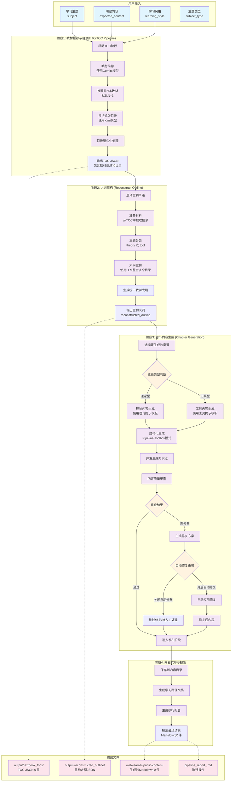

# 教材生成系统工作流程图

## 整体架构图

## 详细处理流程图

```mermaid
graph TB
    subgraph "Phase 1: Textbook Recommendation & TOC Extraction"
        A1[Input: subject, expected_content]
        A1 --> A2[Textbook Recommendation Node]
        A2 --> A3{LLM Used: Gemini}
        A3 --> A4[Search & Recommend Top-N Textbooks]
        A4 --> A5[TOC Retrieval Node]
        A5 --> A6{LLM Used: Kimi}
        A6 --> A7[Parallel TOC Extraction<br/>Max Parallel: 5]
        A7 --> A8[Structure TOCs]
        A8 --> A9[Output: TOC JSON<br/>- recommendations<br/>- tocs<br/>- subject_slug]
    end

    subgraph "Phase 2: Outline Reconstruction"
        B1[Input: TOC JSON]
        B1 --> B2[Prepare Materials from TOCs]
        B2 --> B3[Subject Classification]
        B3 --> B4{Manual or Auto Classification}
        B4 -->|Manual| B5[Use --subject-type param]
        B4 -->|Auto| B6[LLM Classification]
        B5 --> B7[Reconstruct Outline Node]
        B6 --> B7
        B7 --> B8{LLM: Configurable<br/>Default: reconstruct_outline}
        B8 --> B9[Generate Integrated Outline]
        B9 --> B10[Output: Reconstructed Outline<br/>- unified chapters<br/>- sections<br/>- learning objectives]
    end

    subgraph "Phase 3: Content Generation Pipeline"
        C1[Input: Reconstructed Outline]
        C1 --> C2[Chapter Selection]
        C2 --> C3[Convert to outline_struct]
        C3 --> C4{Subject Type}
        C4 -->|Theory| C5[Theory Content Generation]
        C4 -->|Tool| C6[Tool Content Generation]

        C5 --> C7{Structure Type}
        C6 --> C7
        C7 -->|Pipeline| C8[Sequential Generation<br/>with context]
        C7 -->|Toolbox| C9[Dependency-based Generation]

        C8 --> C10[Content Review Node]
        C9 --> C10
        C10 --> C11{Review Passed?}
        C11 -->|Yes| C12[Publish Content]
        C11 -->|No| C13[Fix Proposal Node]
        C13 --> C14{Auto Apply Mode}
        C14 -->|Off| C15[Skip Fixes]
        C14 -->|Safe| C16[Apply minor fixes only]
        C14 -->|Aggressive| C17[Apply if confidence >= threshold]
        C14 -->|All| C18[Apply all fixes]
        C16 --> C19[Updated Content]
        C17 --> C19
        C18 --> C19
        C15 --> C12
        C19 --> C12
    end

    subgraph "Phase 4: Publishing & Reporting"
        D1[Save to Content Directory]
        D1 --> D2[Generate Learning Path MD]
        D2 --> D3[Create Execution Report]
        D3 --> D4[Output: Published Content<br/>- Markdown files<br/>- Learning path<br/>- Execution report]
    end

    %% Connect phases
    A9 --> B1
    B10 --> C1
    C12 --> D1

    %% LLM Configuration annotations
    subgraph "LLM Configuration (config.json)"
        L1[node_llm.recommend_textbooks]
        L2[node_llm.retrieve_toc]
        L3[node_llm.reconstruct_outline]
        L4[node_llm.classify_subject]
        L5[node_llm.generate_and_review_by_chapter.generate]
        L6[node_llm.generate_and_review_by_chapter.review]
        L7[node_llm.propose_and_apply_fixes.propose]
    end

    %% Style definitions
    classDef phase fill:#f0f7ff,stroke:#0066cc
    classDef node fill:#fff5e6,stroke:#ff8800
    classDef decision fill:#ffe6e6,stroke:#cc0000
    classDef output fill:#e6ffe6,stroke:#008800
    classDef config fill:#f5f0ff,stroke:#6600cc

    class A1,A2,A3,A4,A5,A6,A7,A8,A9,B1,B2,B3,B4,B5,B6,B7,B8,B9,B10 phase
    class C1,C2,C3,C4,C5,C6,C7,C8,C9,C10,C11,C12,C13,C14,C15,C16,C17,C18,C19,D1,D2,D3,D4 phase
    class L1,L2,L3,L4,L5,L6,L7 config
    class B4,C4,C11,C14 decision
    class A9,B10,D4 output
```

## 关键特性说明

### 1. **灵活的执行模式**
- **TOC阶段**: 仅执行教材推荐和目录抓取
- **Reconstruct阶段**: 基于已有目录执行大纲重构
- **Full模式**: 完整执行所有阶段（默认）

### 2. **智能内容生成**
- **理论型主题**: 使用理论内容提示模板，侧重概念解释和原理阐述
- **工具型主题**: 使用工具内容提示模板，侧重操作指南和实践应用
- **自动分类**: 支持手动指定或使用LLM自动分类主题类型

### 3. **质量控制机制**
- **内容审查**: 自动检查生成内容的质量
- **修复策略**: 支持多种自动修复模式（off/safe/aggressive/all）
- **迭代优化**: 可多轮修复直至内容达标

### 4. **并行处理能力**
- **目录抓取**: 并行抓取多本教材目录（默认最大5个并发）
- **内容生成**: 根据配置的并发数并行生成内容
- **审查处理**: 并行执行内容质量审查

### 5. **输出管理**
- **结构化输出**: JSON格式的中间结果
- **Markdown内容**: 最终生成的学习材料
- **执行报告**: 详细的处理过程和结果统计

这个工作流程展示了从学习主题输入到最终内容生成的完整过程，包括教材推荐、目录整合、大纲重构、内容生成、质量控制和发布等关键环节。每个环节都可以独立执行或组合执行，提供了高度的灵活性和可配置性。

## 四个阶段的详细技术解释

### 阶段1：教材推荐与目录抓取 (TOC Pipeline)

**目标**：为给定学习主题找到最权威的教材资源，并提取其结构化目录。

**技术实现**：
- **教材推荐**：使用Gemini LLM模型，基于学习主题和期望内容，智能推荐相关教材。系统会分析主题的专业领域、难度级别，并从知识库中匹配最合适的教材。
- **并行目录抓取**：推荐出前N本教材（默认3本）后，使用Kimi LLM模型并行抓取每本教材的详细目录。通过异步处理（最大并发数可配置，默认5个），显著提升抓取效率。
- **结构化处理**：将原始目录文本转换为结构化JSON格式，包含章节标题、子章节、页码等信息，为后续的大纲重构做准备。

**关键技术点**：
- 使用了两个不同的LLM模型，充分利用各自的专长（Gemini在推荐任务上的优势，Kimi在信息提取方面的能力）
- 实现了错误处理和重试机制，确保目录抓取的可靠性
- 输出的TOC JSON包含元数据（如教材ISBN、出版社、推荐理由等）和完整的目录结构

### 阶段2：大纲重构 (Reconstruct Outline)

**目标**：将多本教材的目录整合为一个统一的、结构化的教学大纲，消除冗余并优化学习路径。

**技术实现**：
- **材料准备**：从阶段1的TOC JSON中提取所有教材的目录信息，构建材料库。
- **主题分类**：系统会自动判断学习主题是"理论型"（theory）还是"工具型"（tool），这决定了后续内容生成的策略。用户也可以手动指定类型。
- **智能整合**：使用专门的LLM模型分析多本教材的目录结构，识别共同知识点，消除重复内容，并按照最佳学习路径重新组织内容。
- **结构优化**：生成的大纲包含章节、小节、知识点三个层级，每个知识点都标注了学习目标、建议内容模块和与其他知识点的关系。

**关键技术点**：
- 实现了"去重与合并"算法，智能处理不同教材间的重叠内容
- 保留了知识点的来源信息，便于追溯和验证
- 生成的reconstructed_outline包含丰富的元数据，为后续的个性化生成提供基础

### 阶段3：章节内容生成 (Chapter Generation)

**目标**：根据重构后的大纲，生成高质量的教学内容，确保连贯性和专业性。

**技术实现**：
- **章节选择**：支持选择性生成特定章节，用户可以通过参数指定（如"1,3-4"表示生成第1章和第3-4章）。
- **差异化生成策略**：
  - **理论型内容**：使用理论提示模板，侧重概念解释、原理阐述、例题分析等
  - **工具型内容**：使用工具提示模板，侧重操作步骤、实践指南、注意事项等
- **结构化生成模式**：
  - **Pipeline模式**：按照章节顺序，逐步生成内容，每小节都基于前一节的内容进行延续
  - **Toolbox模式**：知识点之间存在依赖关系，系统会构建依赖图，按最优顺序生成
- **并发控制**：根据系统配置的并发数，并行生成独立的知识点，同时维护知识点间的逻辑关系。

**质量控制机制**：
- **内容审查**：使用专门的审查LLM模型，从完整性、准确性、逻辑性等维度评估生成内容
- **智能修复**：对于未通过审查的内容，系统会生成修复方案。支持四种自动修复模式：
  - `off`：不自动修复
  - `safe`：仅自动修复minor问题
  - `aggressive`：当confidence ≥ 0.8时自动修复major问题
  - `all`：自动应用所有修复建议
- **迭代优化**：可进行多轮修复，直到内容质量达标

### 阶段4：内容发布与报告 (Publishing & Reporting)

**目标**：将生成的内容整理成可发布的格式，并提供详细的执行报告。

**技术实现**：
- **文件生成**：将每个知识点保存为独立的Markdown文件，文件名支持两种模式：
  - `id`模式：使用知识点ID（如`topic-sec-1-1-1.md`）
  - `structured`模式：使用结构化命名（如`sec-1-1-1-introduction.md`）
- **学习路径生成**：自动生成学习路径文档（`learning-path.md`），包含完整的大纲和导航链接
- **执行报告**：生成详细的执行报告，包含：
  - 生成统计（总数、通过数、需修复数）
  - 修复记录（自动应用次数、跳过次数、修复原因）
  - 失败项详情（供人工干预参考）

**输出管理**：
- 所有内容保存到`web-learner/public/content/<topic>/`目录
- 中间结果（JSON）保存在`output/`相关子目录
- 执行报告保存为`pipeline_report_<topic>.md`

## 系统特色

1. **模块化设计**：每个阶段都可以独立运行，支持从任意阶段开始处理
2. **智能路由**：根据任务类型自动选择最合适的LLM模型
3. **容错机制**：实现了完善的错误处理和重试逻辑
4. **可配置性**：通过config.json灵活配置各种参数（并发数、模型选择、修复策略等）
5. **可追溯性**：完整保留了处理过程的日志和中间结果，便于调试和优化

这个系统通过将复杂的教材生成任务分解为清晰的阶段，实现了高度自动化和可控的内容生产流程。