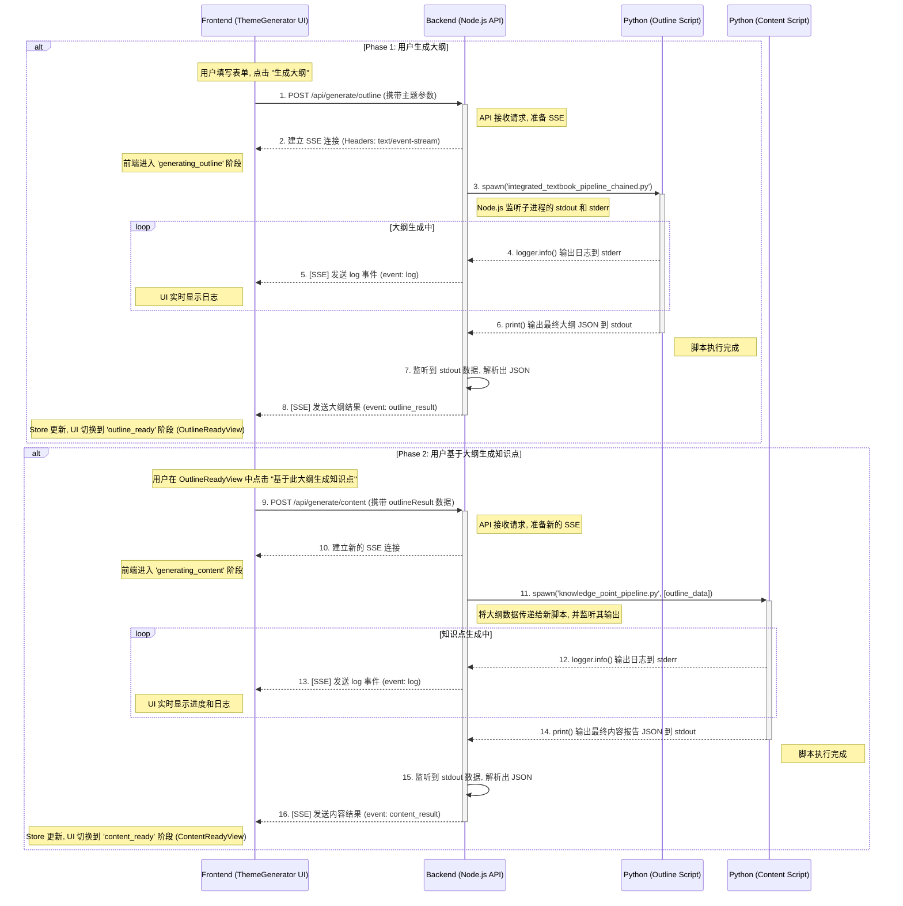

# ThemeGenerator 端到端工作流

本文档使用 Mermaid 图和详细的文字说明，描绘了从用户在 `ThemeGenerator` UI 发起“生成大纲”请求，到最终完成“生成知识点”的完整端到端数据流和处理流程。

## 完整流程图

## 流程详解

整个工作流被清晰地分成了两个主要阶段：

---

### Phase 1: 用户生成大纲 (步骤 1-8)

1.  **发起请求**: 用户点击“生成大纲”，前端向 `/api/generate/outline` 发送请求。
2.  **建立 SSE 连接**: 后端建立一个 Server-Sent Events (SSE) 连接，用于实时通信。
3.  **启动大纲脚本**: 后端通过 `spawn` 启动 `integrated_textbook_pipeline_chained.py` 脚本。
4.  **流式传输日志**: 脚本通过 `stderr` 输出日志。
5.  **转发日志**: 后端捕获日志并通过 SSE 的 `log` 事件发送给前端。
6.  **返回大纲结果**: 脚本完成时，通过 `stdout` 输出最终的大纲 JSON。
7.  **解析结果**: 后端捕获并解析这个 JSON。
8.  **发送大纲结果**: 后端通过 SSE 的 `outline_result` 事件将大纲数据发送给前端，UI 更新到“大纲已生成”(`OutlineReadyView`)的视图。

---

### Phase 2: 用户基于大纲生成知识点 (步骤 9-16)

这个阶段在用户确认大纲后开始，流程模式与第一阶段高度相似，但处理的是不同的任务和数据。

9.  **发起新请求**: 用户在 `OutlineReadyView` 界面点击“基于此大纲生成知识点”。前端会发起一个**新的** `POST` 请求，这次是向 `/api/generate/content`。**关键点**：这次请求的 body 中会包含第一阶段生成的 `outlineResult` 数据。

10. **建立新的 SSE 连接**: 后端为这个新的、独立的任务建立一个新的 SSE 连接。

11. **启动知识点脚本**: 后端 `spawn` 一个**不同的** Python 脚本（例如，一个专门负责将大纲扩展为详细知识点的 `knowledge_point_pipeline.py`）。后端会将上一步接收到的大纲数据作为输入传递给这个新脚本。

12. **流式传输日志**: 知识点生成脚本在执行时，同样会通过 `stderr` 输出其进度日志。

13. **转发日志**: 后端捕获这些日志，并通过新的 SSE 连接实时转发给前端。前端 UI (`GeneratingContentView`) 会显示一个进度条和相关的日志信息。

14. **返回内容结果**: 当所有知识点都生成、审核并发布后，脚本会通过 `stdout` 输出一个最终的 JSON 报告。这个报告可能包含生成了多少文件、报告的路径等信息。

15. **解析结果**: 后端捕获并解析这个最终的报告 JSON。

16. **发送内容结果**: 后端通过 SSE 的 `content_result` 事件将这份报告发送给前端。前端的 store 接收到数据后，将 `stage` 更新为 `content_ready`，并最终显示 `ContentReadyView`。

---

## 数据流衔接完整性分析

在两个阶段的转换点，即用户点击“基于此大纲生成知识点”时，数据流的衔接是可靠的，不太可能出现类似第一阶段的“后端数据无法传到前端”的问题。

1.  **数据存储位置**：
    *   在第一阶段（大纲生成）完成后，后端通过 SSE 将 `outlineResult` 数据发送给前端。
    *   前端的 `useThemeGeneratorStore` (Zustand store) 接收到这份数据后，会将其**保存在前端的内存状态中**。此时，这份大纲数据已经安全地“暂存”在了用户的浏览器里。

2.  **数据传递方式**：
    *   当用户点击按钮启动第二阶段时，会触发 `startContentGeneration` 函数。
    *   这个函数会从 Zustand store 中**读取已经保存好的 `outlineResult` 数据**。
    *   然后，它会发起一个新的 API 请求（`POST /api/generate/content`），并将这份 `outlineResult` 数据作为 **请求体 (Request Body)** 发送给后端。

3.  **与之前问题的本质区别**：
    *   **之前的问题**：是**后端内部**的**进程间通信失败**。Python 子进程没有将结果通过 `stdout` 输出给 Node.js 父进程，导致数据流在后端就中断了。
    *   **现在这个环节**：是**前端到后端**的**一次全新的 HTTP 请求**。数据传递的主动权在前端，前端负责从自己的状态库里取出数据，然后发送出去。只要前端的状态管理是正常的，这份数据就能可靠地发送到后端负责处理内容生成的 API 路由。

**总结：** 两个阶段的衔接点是在前端完成的。数据在第一阶段结束后被前端“接住”并保存，在第二阶段开始时再由前端主动“递给”后端。这个机制非常直接和可靠，避免了后端复杂的多进程数据传递问题。
